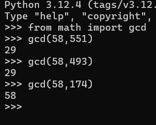
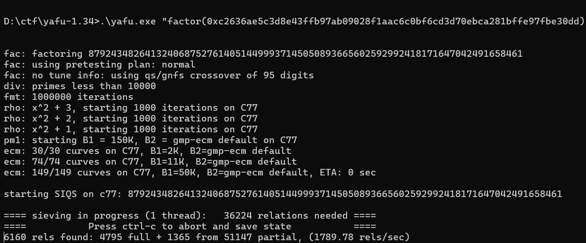
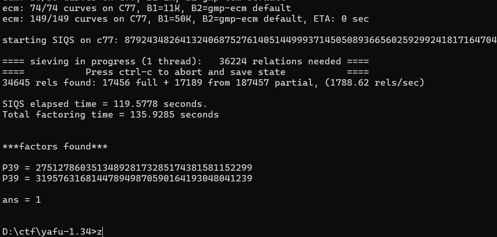

# CTF101 CRYPTO Lab1

## 3240102120

### Task1

这里要进行维吉尼亚密码密码破译。给定了一长串密文文本，同时还有一个python程序用于从明文生成密文。

手动指定plain内容，发现对于相同的明文，每次执行后的加密结果都不一样，字符替换都不同，而且print出来的密钥串也不同。唯一相同的是空格位置。考虑以空格位置为突破点进行操作。

阅读完程序后可知加密方法为使用randrange生成不定长(15 ~ 29)的1 ~ 96数字作为密钥串，然后按维吉尼亚方法对原字符串进行加密，区别在于本程序是进行了乘法运算，而空格位于index=0的位置，因此对于任何空格都不加密。

首先还原原文为一个list（此处省略结果）：

```python
with open("./venege.txt", 'r') as f:
    cipher = f.read()

textline=' !"#$%&\'()*+,-./0123456789:;<=>?@ABCDEFGHIJKLMNOPQRSTUVWXYZ[\\]^_`abcdefghijklmnopqrstuvwxyz{|}~\t\n'

def reget(s):
    return [textline.index(i) for i in s if i in textline]
```

既然是乘法运算，紧跟着就会有下个突破口：密文列实际上是一个余数列。那么理论上来说，我们需要做的就是对1\*1 ~ 96\*96里的所有数做质数分解，以此来确定每一个密文数可能对应的明文。又因为两个乘数都在1 ~ 96内，因此写一个这样的函数来试图反推密文：

```python
def unlock_1(s):
    pos=[]
    _x=0
    _m=s
    while _m<9217:
        # pos: list[tuple[int, int]]
        pos.extend([(textline[_m//_i],_i) for _i in range(1,97) if _m%_i==0 and _m//_i < 97])
        _x+=1
        _m+=97
    return pos
```

这个函数会返回所有密文可能对应的明文结果及其对应的密钥。虽然经过测试，每个密文都可能还原成其他95种中的任意一种：

```python
testt=[]
for test in textline[1:]:
    test1=set([i[0] for i in unlock_1(test)])
    test2=set(textline[1:])
    test3=len(list(test2-test1))
    if test3>0:
        testt.append(test)
print(testt)

#输出：[]
```

再考虑回维吉尼亚的原理：密钥是循环的，也就是说一定是15~29中的一种循环。应该想办法找到这个循环周期T，这样可以确定每T位的加密密钥是一样的，进而可以尝试确定。

查看原文，因为英文里面“the”使用率最高，所以尝试找到前30位里那些被空格分割开的长为3的字符，然后全文寻找确定他们的出现频率。这里很轻松地找到了`{gY`。全文出现了7次，基本锁定这就是the。再对其出现位置进行查找：

```python
x=[]
for index,i in enumerate(cipher):
    if i =="{" and cipher[index+1]=="g" and cipher[index+2]=="Y":
        x.append(index)
for i in range(len(x)-1):
    print(x[i+1]-x[i], end=" ")

#输出：58 551 493 174 377 435 
```

简单测试了两个gcd发现它们都是29的倍数：



于是可以考虑T=29。

有了这几个初始条件，我们基本可以继续往后确定几乎所有内容了。首先第四五六位密钥可以直接确定为90,67,43：

```python
a,b,c=unlock_1(rere[3]), unlock_1(rere[4]), unlock_1(rere[5])

for i in a:
    if i[0]=="t":
        print(i)
for i in b:
    if i[0]=="h":
        print(i)
for i in c:
    if i[0]=="e":
        print(i)

#输出：('t', 90)
#('h', 67)
#('e', 43)
```

密钥暂时确定为`[-1,-1,-1,90,67,43,-1,-1,...,-1]`（-1代表不确定）。

为了方便观察，我们用数字代表还未解密的部分，用解出的字母代表已解出的部分，每29位一分割，按行排列：

```python
segments = [rere[i:i+29] for i in range(0, len(rere), 29)]

rrkey=[-1,-1,-1,90,67,43,-1,-1,-1,-1,-1,-1,-1,-1,-1,-1,-1,-1,-1,-1,-1,-1,-1,-1,-1,-1,-1,-1,-1]

def unlock_2(s,key):
    x=unlock_1(s)
    for i in x:
        if i[1]==key:
            return i[0]

for i in segments:
    for j in [3,4,5]:
        if i[j]==0:
            i[j]='空'
            continue
        i[j]=unlock_2(i[j],rrkey[j])

with open("vegene_first.txt", "w", encoding='utf-8') as out_file:
    for i in segments:
        i=[x if x!=0 else '空' for x in i]
        line = ""
        for x in i:
            line += f"{x:<2}" if x=="空" else f"{x:<3}"
        out_file.write(line + "\n")
```

由于每29位密钥重复，因此每行的456列均已知密钥，那么就可以直接解密。注意为了对齐使用了空格，而为了防止歧义，暂时使用“空”代替空格。

发现遗漏了换行符，紧急补救一下：

```python
with open("vegene_first.txt", "w", encoding='utf-8') as out_file:
    for i in segments:
        i=[x if x!=0 else '空' for x in i]
        i=[x if x!='\n' else '新' for x in i]
        line = ""
        for x in i:
            line += f"{x:<2}" if x in["空",'新'] else f"{x:<3}"
        out_file.write(line + "\n")
```

观察已有内容，发现第五十行中有一个AA{，所以直接考虑第三列的47对应A。得到密钥22。

```python
def unlock_3(s,t):
    x=unlock_1(s)
    for i in x:
        if i[0]==t:
            return i[1]

print(unlock_3(47,'A'))
```

感觉做到这工具函数差不多齐了，就是unlock_1,2,3。unlock1因为发展原因被黑盒套起来了，所以只要知道某一列的数对应的字母就可以直接用unlock_3拿密钥，更新rrkey然后让程序调用unlock_2用密钥解这列其他数。循环直到解出29个数为止。这里推理过程有时候依靠灵感，所以尽可能简写，不再赘述。为了不再只适应345，以下对for i in segments改进：

```python
for i in segments:
    for index,j in enumerate(rrkey):
        if index>=len(i):
            break
        if j!=-1:
            i[index]=unlock_2(i[index],j)
        if i[index]==0:
            i[index]='空'
```

以下是推理：

44行：空 doin 43 空 猜测doing，第七列43=g。

13行：.Aft 32 56 空 猜测After，第八九列分别有32=e，56=r

3行：空 Am 9 64 81 46 96 24 空，因为前面是the，所以考虑可能是American，暂时先不写。

6行：空 citize 65 8 空，猜测citizen, 虽然8还不确定，但是确定第九列65是n。

6行确定了第三行第九列是e，所以确定是American，于是直接解出10~15列

18行：空 New 空 Yo 61 5 88 空，猜测是New York,或.。先认定16,17列的61,5是rk

31行：空 physi 71 58 空，猜测是physics，解出18,19列的71,58是cs

1行：空 the 空 nineteen 57 24 空，猜测是二十世纪，进而推测前面的85 82是In，解出1,2,20,21列。但是似乎In解错了，退回-1

3行：空 langu 49 62 26 44 空猜测是language，解出22,23,24列

4行：空 begi 92 ... 猜测是begin...，解出25列

6~7行：United 空 43 6 54 16 93 s.。直接猜测 United States，解出27,28,29,1,2列。（到这验证出前面那个In猜错了，实际是By）

1行：cen 75 ury, 猜26列75=t。解出全部内容

最后，只需要写个小脚本还原文本即可：

```python
with open("./vegene_first.txt",'r',encoding='utf-8') as f:
    c=f.read().split("\n")

this=''
for line in c:
    singles = line.split(" ")
    for si in singles:
        if si=="":
            continue
        elif si == "空":
            this+=" "
        elif si == "新":
            this+="\n"
        else:
            this+=si

with open("./vegene_final.txt",'w',encoding='utf-8') as f:
    f.write(this)
```

原文文本为：

```plaintext
By the...ficient icebox.
fLaG:AAA{i_like_T0ef1_v3ry_M3uh!!!}
But as ea...
```

得到flag：`AAA{i_like_T0ef1_v3ry_M3uh!!!}`

说实话，这个题真的有点给我做爽了，感觉思路不会像misc一样特别难搜，但是又不会像rsa那样很轻松地拿到答案。总之是个好题！

因为题目的脚本是随写随删的，所以也没有留下特别有用的全部解密脚本，以下是用完的碎片脚本，将就着看：

```python
'''with open("./vegene.txt", 'r') as f:
    cipher = f.read()

textline=' !"#$%&\'()*+,-./0123456789:;<=>?@ABCDEFGHIJKLMNOPQRSTUVWXYZ[\\]^_`abcdefghijklmnopqrstuvwxyz{|}~\t\n'

def reget(s):
    return [textline.index(i) for i in s if i in textline]

def unlock_1(s):
    pos=[]
    _x=0
    _m=s
    while _m<9217:
        # pos: list[tuple[int, int]]
        pos.extend([(textline[_m//_i],_i) for _i in range(1,97) if _m%_i==0 and _m//_i < 97])
        _x+=1
        _m+=97
    return pos

rere=reget(cipher)

segments = [rere[i:i+29] for i in range(0, len(rere), 29)]

def unlock_2(s,key):
    x=unlock_1(s)
    for i in x:
        if i[1]==key:
            return i[0]
        
def unlock_3(s,t):
    x=unlock_1(s)
    for i in x:
        if i[0]==t:
            return i[1]

_c=[75]#num
_d="t"
for ii,jj in zip(_c,_d):
    print(unlock_3(ii,jj),end=",")
    pass

rrkey=[51,14,22,90,67,43,17,82,48,17,41,33,89,94,60,80,13,72,79,18,65,50,20,6,36,39,56,7,65]

for i in segments:
    for index,j in enumerate(rrkey):
        if index>=len(i):
            break
        if j!=-1:
            i[index]=unlock_2(i[index],j)
        if i[index]==0:
            i[index]=' '


with open("vegene_first.txt", "w", encoding='utf-8') as out_file:
    for i in segments:
        i=[x if x!=' ' else '空' for x in i]
        i=[x if x!='\n' else '新' for x in i]
        line = ""
        for x in i:
            line += f"{x:<2}" if x in["空",'新'] else f"{x:<3}"
        out_file.write(line + "\n")

'''

with open("./vegene_first.txt",'r',encoding='utf-8') as f:
    c=f.read().split("\n")

this=''
for line in c:
    singles = line.split(" ")
    for si in singles:
        if si=="":
            continue
        elif si == "空":
            this+=" "
        elif si == "新":
            this+="\n"
        else:
            this+=si

with open("./vegene_final.txt",'w',encoding='utf-8') as f:
    f.write(this)
```

### Task2

这里选择Task2.2：RSA的密钥解析

题目叽里呱啦说啥呢，看看关键部分就几个，一个是很PEM的密钥前半部分，另一个是十六进制密文。看起来就是想办法解析PEM格式密钥然后把密文解成明文即可。

MIGrAgEAAiEAwmNq5cPY5D/7l6sJAo8arGwL9s09cOvKKBv/6X++MN0CAwEAAQIgGAZ5m9RM5kkSK3i0MGDHhvi3f7FZPghC2gY

先用len看下长度，发现是99，所以先尝试解密100位：

`3081ab020100022100c2636ae5c3d8e43ffb97ab09028f1aac6c0bf6cd3d70ebca281bffe97fbe30dd020301000102201806799bd44ce649122b78b43060c786f8b77fb1593e0842da06`

上网上找了一下PKCS#1的格式，3081ab是头，020100是version=0，后面02开头的是n和e，这里0221是n有0x21字节，后面66位都是n，也就是n=0xc2636ae5c3d8e43ffb97ab09028f1aac6c0bf6cd3d70ebca281bffe97fbe30dd；接下来0203是e有3字节，0x010001=65537。接着就是d了，先是0220说明有32字节，但是只有42位，所以先暂且放下d的破译，想办法利用一下n和e。

不过还好爷爷奶奶买了我最爱吃的yafu-x64.exe，启动一下尝试分解n：



哇，奶奶讲了我最喜欢的factor哄我入睡：



那么varphi(n)就很好得到了，接着做模逆就能求私钥了。请出老脚本：

```python
p=275127860351348928173285174381581152299
q=319576316814478949870590164193048041239
n=0xc2636ae5c3d8e43ffb97ab09028f1aac6c0bf6cd3d70ebca281bffe97fbe30dd
e=65537
phi=(p-1)*(q-1)
d=pow(e, -1, phi)
c="1c194cd4f48d77b2e14cace43869bea17615ab23da0ef63b7bf56116ad3ac93b"
from Crypto.Util.number import long_to_bytes
m=pow(int(c,16),d,n)
print(long_to_bytes(m).decode('utf-8'))
```

执行脚本输出结果：`AAA{N3veR_Le4k_PR1va7eK3y_Ag41N}`

但是这样还是太吃操作了，假如有人的爷爷奶奶不给他买yafu吃，也不让他玩factordb，那就要尝试高位攻击了。

首先已知长度是64位16进制，已经泄露的有42位`1806799bd44ce649122b78b43060c786f8b77fb1593e0842da06`，需要破开剩下22位，也就是88bit。

在网上找了一下关于高位爆破的知识，看到高位爆破不止关于d的，还有别的内容的。不过d的高位爆破还是希望先转到高位p，再尝试用p去还原。

原理如下： $$ ed=k\varphi(n)+1 $$ 假设已知的 $ d $ 是 $ d_0 $ ，设 $ s=p+q $ ，就有 $$ ped = pk(n-s+1)+p $$ 而根据 $$ ps = p^2 + pq = p^2 + n $$ 代入就可以消掉 $ s $ ，得到 $$ ped = kpn - k(p^2+n) + pk + p $$ 而 $$ d=d_0 + x $$ ，这里 $ x $ 是不知道的低位 $ d $ ，于是 $$ ped_0 + pex = kpn+pk+p-kp^2-kn $$ 由于 $ x $ 不知道且比较小，而且建立在已知高位爆破 $ p $ 的算法基础上，所以可以直接忽略 $ pex $ 这一项，直接求解 $$ ped_0 = kpn+pk+p-kp^2-kn $$ 可以得到一个近似的 $ p $ ，因为高位的 $ d $ 是准确的，所以这里 $ p $ 的高位也是准确的。接下来再进行高位爆破 $ p $ 即可。

而高位爆破 $ p $ 的原理是，因为 $ p | n $ ，所以对于方程 $$ x \equiv -p_{high} (mod p) $$ 来说， $$  x \equiv -p_{high} (mod n) $$ 也能求得一个可能满足的小解。从而解得全部 $ p $ 。

然后又花了114514分钟学了一下sage，大概写了下面这个程序：

```python
from sage.all import *
from Crypto.Util.number import *
from tqdm import tqdm

d0=0x1806799bd44ce649122b78b43060c786f8b77fb1593e0842da06
n=0xc2636ae5c3d8e43ffb97ab09028f1aac6c0bf6cd3d70ebca281bffe97fbe30dd
e=65537

PR.<x>=PolynomialRing(RealField(1000))
p=0 #初始化，如果后面没爆出来会raise error，所以不用assert
for i in tqdm(range(1,e)):
    f=e*d0*x-(i*x*(n+1)+x-i*n-k*(x**2))
    xyz=f.roots() #求解
    for x in xyz:
        ZZn=Zmod(n)
        ph=int(x[0])
        PR.<X>=PolynomialRing(ZZn) #再建一个用来爆p的环
        fp=X+ph
        roots2=fp.small_roots(x=2^92,beta=0.4) #求解
        y=int(roots2[0])
        p=int(gcd(y+ph,n))
        if 1<p<n and n%p==0: #爆出正确的p了，求q求d即可，否则继续找下一个x解
            q=n//p
            varphi=(p-1)*(q-1)
            d=inverse(e,varphi)
            print(f"found p:{p}\n      and q:{q}\n      and d:{d}")
            exit()
```

总而言之，感觉rsa相对来说更吃操作一点，那一步直接把pex给省掉了我是真没想到啊，这算法谁能想出来呢，居然还能靠p高位爆p，不得不佩服人类的智慧
