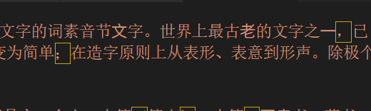
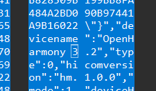
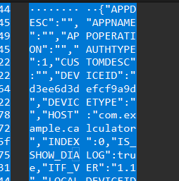
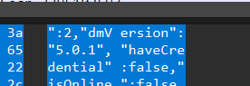
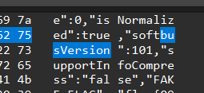

# CTF101 MISC Lab1

## 3240102120

### Task1

这里选择直接做NATO26。先上flag: `ZJUCTF{Y0u_rE@lLy_Kn0W_encODIng}`

因为NATO是北约字母表（无线电狂喜），所以想办法先把北约字母表相关内容找出来。然后经过六种方法遍历发现`encode=gbk & decode=utf-8`的时候是最接近人话的：

```plaintext
原理类似贝斯五十�?��贝斯二十�?��码其内�?为喝彩声帕帕利马魁北克回音查理均匀帕帕回音祖鲁人狐步探戈�?拉均匀朱丽叶朱丽叶魁北克德尔�?祖鲁人威�?��高尔�?��高尔�?��埃克�?��线喝彩声奥斯卡埃克斯射线祖鲁人麦克回音均匀祖鲁人�?拉德尔�?酒店胜利者高尔夫球公斤胜利者麦克十一月回音胜利者威�?��塞拉�?��德尔塔公斤印度查理麦克阿尔法印度均匀奥斯卡喝彩声
```

这里面仍然有乱码，考虑可能是传输错误或者别的什么原因。不过大体上能看出来了，所以就直接用nato表往里套，能套出这么个东西：

```plaintext
bplqecupezftsujjqdzwggxboxzmeuzsdhvgkvmnebwsdkicmaiuob
```

交一下发现不是flag，所以还得解。原文里面有提示说“原理类似于贝斯五十X贝斯二十X码”，所以考虑一下Base58，但是因为原文里面有o和l，估计base58也要败下阵来，（<s>这里卡了一个下午+一晚上，而且听说去年只有十几个人做出NATO26，有1点草单</s>

早上起来重新考虑了一下贝斯五八，结合题目叫NATO26，所以考虑是不是BASE28. 所以就应该是把a~z作为0~25，然后按位相加得到一个数，这个数转hex之后两位一截转utf-8。所以编写了如下脚本执行这个任务：

```python
a='bplqecupezftsujjqdzwggxboxzmeuzsdhvgkvmnebwsdkicmaiuob'
b=0
for i in range(len(a)):
    b = b * 26 + (ord(a[i]) - ord('a'))
c='0'*(8-(len(bin(b)[2:])%8)) + bin(b)[2:] #去0b
b=0
d=''
while b < len(c):
    b+=8
    d+=chr(int(c[b-8:b],2))
print(d)
```

最终可以得到答案。

*注：以下是灵光乍现产物，看乐子即可！*

诶🤓☝️，作为noob of python，这个小脚本理论上可以无限压行，让我尝试一下：

```python
print(''.join([chr(int(('0'*(8-(len(bin(sum([(ord('bplqecupezftsujjqdzwggxboxzmeuzsdhvgkvmnevwskdkicmaiuob'[i])-ord('a'))*(26**(len('bplqecupezftsujjqdzwggxboxzmeuzsdhvgkvmnevwskdkicmaiuob')-i-1)) for i in range(len('bplqecupezftsujjqdzwggxboxzmeuzsdhvgkvmnevwskdkicmaiuob'))]))[2:])%8)) + bin(sum([(ord('bplqecupezftsujjqdzwggxboxzmeuzsdhvgkvmnevwskdkicmaiuob'[i])-ord('a'))*(26**(len('bplqecupezftsujjqdzwggxboxzmeuzsdhvgkvmnevwskdkicmaiuob')-i-1)) for i in range(len('bplqecupezftsujjqdzwggxboxzmeuzsdhvgkvmnevwskdkicmaiuob'))]))[2:])[i-8:i],2)) for i in range(8, len('0'*(8-(len(bin(sum([(ord('bplqecupezftsujjqdzwggxboxzmeuzsdhvgkvmnevwskdkicmaiuob'[i])-ord('a'))*(26**(len('bplqecupezftsujjqdzwggxboxzmeuzsdhvgkvmnevwskdkicmaiuob')-i-1)) for i in range(len('bplqecupezftsujjqdzwggxboxzmeuzsdhvgkvmnevwskdkicmaiuob'))]))[2:])%8)) + bin(sum([(ord('bplqecupezftsujjqdzwggxboxzmeuzsdhvgkvmnevwskdkicmaiuob'[i])-ord('a'))*(26**(len('bplqecupezftsujjqdzwggxboxzmeuzsdhvgkvmnevwskdkicmaiuob')-i-1)) for i in range(len('bplqecupezftsujjqdzwggxboxzmeuzsdhvgkvmnevwskdkicmaiuob'))]))[2:])+1, 8)]))
```

运行即可获得flag
（虽然只用了一行但是非常的臭）

（后面和其他几个人讨论了一下才知道这玩意居然出题的时候就出全损题，那有点坏了）

### Task2.2.1

参考了[直呼赚烂](https://zhuanlan.zhihu.com/p/453675608)

GB2312最早出，GBK是GB2312的扩充版，然后GB18030的两版是前两者的大合集，补充了中日韩用汉字。

读完文章可以知道GB2312用94个区、每个区内94个字的方式确定了汉字和字符，然后用区编号和区内编号来确定某一汉字（字符）。这是区位码；为了兼容ASCII，引进国标码，即把区编号和区内编号都加上32以避开不可打印字符。又由于国标码中大部分数字都与ASCII码的字母重合，所以就再给每个码+128（最高位置1），得到最终的内码。

GBK向下兼容了GB2312，然后添加了GB2312没有用到的编码范围，比如0x81-0xA0+0x40-0xFE这个范围（除去每一区的0x7F），用于添加一些不常用的汉字和字符。

GB18030则兼容GB2312+基本兼容GBK，增加了一个“四字节”，有点像是那个Huffman树，在四字节区添加了更多的字符。

这里为了完成兼容，GB2312选择让出ASCII码范围，在+128的区间内编码；而其他GB系列全部选择向下兼容，保留GB2312的编码范围，在GB2312未使用的区域继续编码其他字符。

### Task2.2.2

把附件内容下载下来放到vsc里就立竿见影：



猜测可能是前好几年有人拿这个捉弄人的康熙部首（在小破站评论区经常有人拿这玩意玩，弹幕用康熙部首的透明度都和普通的不一样），所以尝试把这些东西提取出来。

这里把部首和汉字一一对应起来。然后根据AliyunCTF2024的题解，考虑这些字里替换和没替换的。于是有了如下代码：

```python
# 这里省略a的赋值，a是用with open("./.text")获得的附件原文本
kangxi_1='一二人入八几力十又口土士大子小山工手文方无日月木止比毛氏水玄玉生用目石示立竹老而自至色行言赤足身酉里金隶青非面革音骨鬲'
kangxi_2='⼀⼆⼈⼊⼋⼏⼒⼗⼜⼝⼟⼠⼤⼦⼩⼭⼯⼿⽂⽅⽆⽇⽉⽊⽌⽐⽑⽒⽔⽞⽟⽣⽤⽬⽯⽰⽴⽵⽼⽽⾃⾄⾊⾏⾔⾚⾜⾝⾣⾥⾦⾪⾭⾮⾯⾰⾳⾻⿀'
kangxi=kangxi_1+kangxi_2
c=''
for char in a:
    if char in kangxi:
        c+='0' if char in kangxi_1 else '1'
print(c)
print(len(c))
```

得到输出

```console
00000110100001000001101000010000011010000100000111011011000001101101010000011011111100000111010010000001101001010000011001010000000110010001000001101010010000011011100100000110111111000001110010110000011010111000000110010000000001110101110000011011111100000110100111000001101000100000011101110100000000000000000000000000000000000000000000000000000000000000000000000000000000
374
```

然后尝试去分割。首先观察后面有一堆零，所以就遍历尝试按每2~16个分割

```python
for m in range(2,17):
    chunks = [c[i:i+m] for i in range((0, len(c) - len(c))%m, m)]
    chars = [chr(int(c, 2)) for c in chunks]
    output = ''.join(chars)
    print(output)
```

得到结果：
```console
2
3
4


␦ ␦

␦
6 (␦!604 ␦$␦$9/0,.$?)0␦
7 !!![5?R%)9?K.W?'"]
8 ␦hAÛÔt¥PjA¹ü°k\iÁ¢t
ÐĆĈvƃÔ7ǁƤ␦ Ɣ
pÑèLjoƃĬ5ƁĠàƿ
10 ␦AʄhćưƵ͈iĆŀƑ␦Ɂˤȯ°Ʈ͜ŏɰƢ̀
11 4ĆРڄíЛʃϰΤiȌԁ҈Ʃ7Ćߠܬ×հ;i؍ۨ
12 hКĆࡁධ۔ƿtࠚԆԁऐڤƹoజଆ஁ऀݜƿiచȇ݀
13 Ðၨ࠴Нᘍᔆᾃᒁᒠ᥀ಈڤͲƿåၫဲญἆᎃࢁᮠ
14 ơơơǛƵƿǒƥƔƑƩƹƿNjƮƐǗƿƧƢǝ
15 ͂ڄഈᶰ㚠濁椃┆⠌䐚䠷ၯ惥䆮̠ݜ෸ᩰ㑀着
16 Traceback (most recent call last):
  File "d:\ctf\character.py", line 113, in <module>
    print(m,output)
UnicodeEncodeError: 'utf-8' codec can't encode character '\udb06' in position 3: surrogates not allowed
```

仔细观察就不难发现7和14的分割方法比较整齐，而7的形式又是!!!\[...\]，联想到flag一般为AAA或者ZJUCTF，所以查看ascii码表，把按7分割的每一个都+32，使得!变成A，\[\]变成{}。

```python
chunks7 = [c[i:i+7] for i in range(0, len(c) - len(c)%7, 7)]
chars7 = [chr(int(c, 2)+32) for c in chunks7]
print(''.join(chars7))
```

```console
#A#A#A#{#U#_#r#E#4#1#I#Y#_#k#N#0#w#_#G#B#}
```

发现每个中间都卡了一个#，删除即可

```python
chunks7 = [c[i:i+7] for i in range(0, len(c) - len(c)%7, 7)]
chars7 = [chr(int(c, 2)+32) for c in chunks7]
chars7 = [y for y in chars7 if y !='#']
print(''.join(chars7))
```

得到flag：

```console
AAA{U_rE41IY_kN0w_GB}
```

### Task 3.1

课上完整演示过，以下是我的操作过程：

首先用wireshark打开给定的.pcap。看四个问题分别是：

1. 已知两个设备的名字是相同的，它们的名字是什么？(如果设备名中有空格则用_替代，例如Name 1.0写为Name_1.0)
2. suspicious_traffic.pcap流量所对应的应用程序是什么？(英文名词单词，如application)
3. 目标设备的分布式设备管理组件版本号是什么？(如1.1.1)
4. 通信过程使用的软总线版本号是多少？(如999)

第一个问题：只需要使用Ctrl+F按字节流搜索devicename即可，可以找到devicename是：OpenHarmony 3.2



于是得到第一个问题的答案：`OpenHarmony_3.2`

第二个问题：尝试搜索app，发现appname对应段为空，但下面的host有com.example.calculator



所以认为应用名称是calculator，得到第二个问题的答案：`calculator`

第三个问题：搜索dmVersion即可：



得到第三个问题的答案：`5.0.1`

第四个问题：同理，搜索busVersion即可：



第四题答案：`101`

拼接得到最终的结果：`OpenHarmony_3.2_calculator_5.0.1_101`

然后使用以下python程序生成md5：

```python
a='OpenHarmony_3.2_calculator_5.0.1_101'
import hashlib
print("flag{"+hashlib.md5(a.encode()).hexdigest()+"}")
```

得到答案：

```console
flag{9cbba4ca92014908452e64de19e3e7ad}
```

这道题是基于OpenHarmony的软总线流量分析取证，主要就是使用Wireshark的搜索功能和过滤器（其实过滤器没咋用）找到流量取证，用流量包分析来获取所需要的信息，比如题中要求的设备名称和应用名称等。

### Task 4

校巴上的crack_zju_wlan。首先下载附件得到一个.img文件。用file查看发现是一个linux下的ext2挂载映像，所以使用mount把它挂载到一个文件夹下。打开文件夹就能获得crack_zju-01.cap

hint里给定了一个xxx-ng用于分析网络流量，去bing上把hint原封不动进行搜索可以得到aircrack-ng是提示的全文。所以下载一个aircrack-ng文件，然后用这个文件打开crack_zju-01.cap，但是结果是只找到了180个IV，而分析需要至少5000个IV。考虑是不是这一个.cap不够，可能还存了其他cap。

回去用ls -a查看隐藏文件，找到了一个.password.txt.swp，于是用`vim -r .password.txt.swp`恢复文件得到了一个password.txt。那么使用`aircrack-ng crack_zju-01.cap -w password.txt`，终端就有输出` KEY FOUND! [ 0YcWPeLMBp ]`。所以flag就是`AAA{0YcWPeLMBp}`

### Sumup

感觉misc是我比较感兴趣的一个方向，虽然做题是在“妈的这出题人脑袋有毛病？”和“卧槽这出题人简直是天才”之间反复横跳，但是misc给我的整体感觉是一种灵活且优雅的题目类型，而且涉及方向比较多，对我这种主战场是python的人也比较友好，所以个人很喜欢misc，当然也选择了misc作为下一个方向。希望能在专题课上学到更多东西，然后也希望自己可以在ZJUCTF2025里面的misc方向拿到一个比较好的成绩

课讲的很好！
