# CTF101 MISC Lab2

## 3240102120

### Challenge1

flag: `AAA{the_true_fans_fans_nmb_-1s!}`

啊呀，骇死我哩！（大石碎胸口.mp3正在播放）

互联网上搜索一下真正的粉丝，可以在wiki下面找到江主席的相关词条。猜测可能是recognize或者+1s的梗。

走一下solve发现有两个jpeg

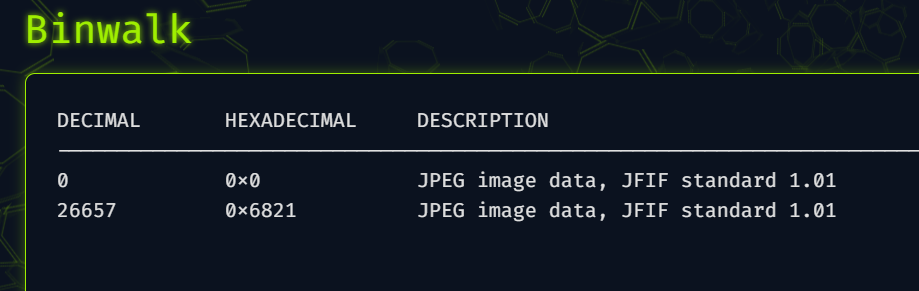

所以尝试分离：

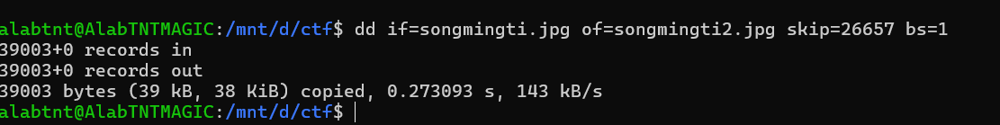

成功得到第二部分图片


得到flag。

### Challenge2

flag: `AAA{D0_Y0u_L1ke_Ste9H1de_M1a0}`

麻了，上来就拿alert草我。感觉可能是上次那个1000多次的刷新，然后里面不一定哪一次存着flag

但是F12里面啥啥都没有，那不要怪我关你的js了：

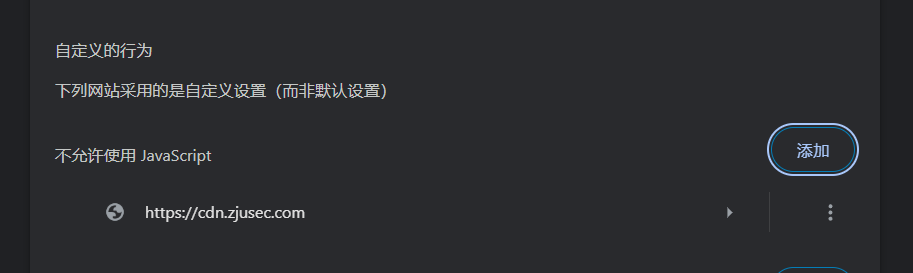

再进入网站可以打开一张图片，地址是`https://cdn.zjusec.com/Nov2/img/miao~870F6C667A6CDC0D1F533859E72C48E0.jpg`，下载下来，顺便看一下html，居然是`for(;;)`，还好没浪费时间爆

用solve跑一下，看到binwalk里面有tiff，提取一下tiff。但是好像这个tiff打不开。lsb没有隐写，string也是一坨。

既然是tiff，考虑一下藏其他文件比如zip或者txt，这么小不太可能藏zip。刚才看了aperi的solve，再试试stegsolve和hex。

steg还没启动就在hex里面找到了一个key：

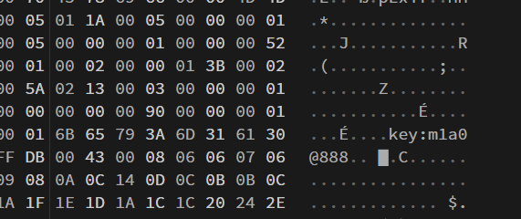

那合理猜测是靠这个key藏东西了，用steghide解一下

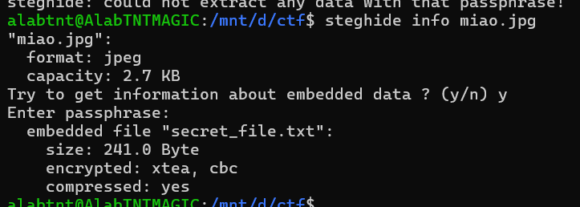

很好啊，一下子就对了，那直接extract就好了：

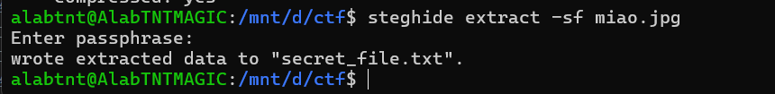

得到一串0101：`010000010100000101000001011110110100010000110000010111110101100100110000011101010101111101001100001100010110101101100101010111110101001101110100011001010011100101001000001100010110010001100101010111110100110100110001011000010011000001111101`

chef炒一下菜：

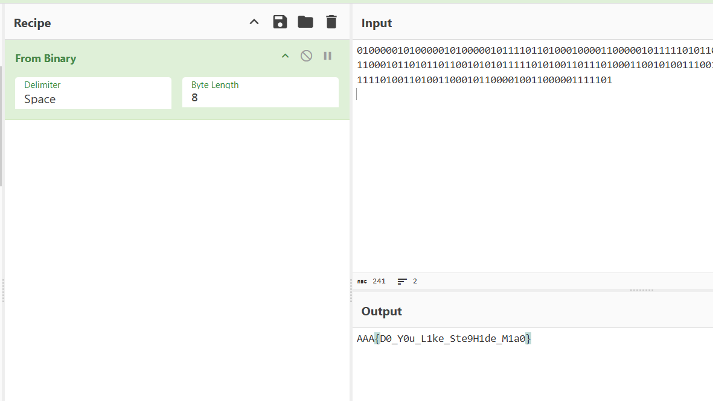

得到flag

### Challenge3

flag:`AAA{I_l0v3_Ar1har4_N4n4m1_for3ver}`

Ciallo～ (∠・ω< )⌒★

我之前就听说有柚子厨的题了，专门等0721这天做的。<s>（柚子÷来了，快跑啊（捏鼻）</s>

但是这个图有点强把aperi都给整炸了，一直500error。那先用stegsolve平替一下，反正题目说是lsb了，正好刚打开的stegsolve还没用上。

打开之后rgb全试了一遍都没啥信息，感觉像是rgb下面藏string的信息了，写个py脚本：

```python
from PIL import Image

img = Image.open("nanami.png")
pixels = list(img.getdata())
bits = []
for p in pixels:
    for channel in p[:3]:
        bits.append(channel & 1)
data = bytearray()
for i in range(0, len(bits), 8):
    byte = 0
    for b in bits[i:i+8]:
        byte = (byte << 1) | b
    data.append(byte)
with open("nanami.lsb", 'wb') as f:
    f.write(data)
```

得到一个lsb文件，应该是稳了，用file看一下lsb：

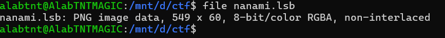

是个png，直接改成png：


还没有flag，但是既然是对话框……是不是图片被截过？用hex把高度从60改成600：

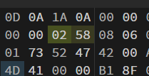

得到新图片：


即获得flag。

### Challenge A

flag: `AAA{gOoD_joB_P4lEtTE_M0D3_c@N_al$0_57E9o!}`

aperi工具直接秒杀比赛：

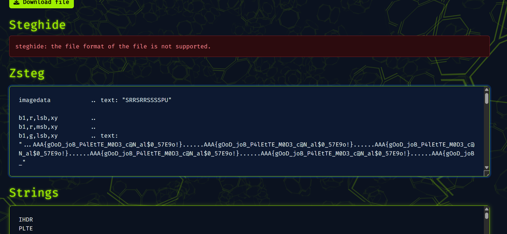

但是用工具只能拿10%，所以还是乖乖写一下代码：

```python
from PIL import Image
t=Image.open('palette.png')
x=[]
for i in range(t.size[1]):
    for j in range(t.size[0]):
        x.append(t.getpixel((j, i)) & 1)
final=''
for i in range(0,len(x),8):
    b=x[i:i+8]
    final+=chr(int(''.join(map(str,b)),2))
print(final)
```

可以得到一串输出，是flag重复114514次

### Challenge B

又到了我最喜欢的python题时间（并不喜欢python题（目移

阅读源代码，需要考虑librosa这个库。为了方便测试，我从autopiano这个网站上把C4.mp3给扒下来当测试的生成文件。

首先是把音频文件load进来，变成一串数据，所以按理说我写的脚本最后一步是把一堆数据和采样率恢复成一个音频。经查询得知要用soundfile库，语句是`soundfile.write(output, y, sr)`。

下一步是生成了一个spectrogram。经过我的<s>不懈努力</s>测试（比如我并不特别熟悉ndarray所以还转了int），发现这是个长32宽320的二维数组。结合前面的`num_freqs=32`，而且数了一下给的gif的条数正好是32，所以认为这个长是每一个频率（可能？）对应的每一帧的播放情况。

接下来往后是依托答辩，不得不说这个压行写的是真的好（？），最外层的gif_data是`for frame in spectrogram.transpose()`这个生成器生成的，而`transpose()`结果是转置，也就是每个frame都是一个长32的列，按我这个是有320帧。那么就是说接下来的操作是把这320帧计算然后写成gif。

里层是进行kron计算，查了一下这个计算方法是按列迭代相乘得到新矩阵。需要两个矩阵，一个是`numpy.array()`得到的一会看，另一个是`numpy.ones([quantize,quantize,1])`，这是个三维数组2\*2\*1，那可以暂时认为这是个四方格。

接下来看array()生成的内容，里面是两个list套一块了，第一个list生成器是`for freq in range(num_freqs * 2 + 1)`，也就是freq在0~64之间遍历，第二个list的生成器是`for i in reversed(range(min_db, max_db + 1, quantize))`，i是31~-60两步一步进，也就是31,29,...,-59。生成器里面的内容是主要的，生成了color_pixel或while_pixel，如果freq是奇数且i比`frame[freq//2]`的四舍五入要小，前者是为了让条形之间有空隙，比如freq作为4的时候，5和3之间就有一条纯白，以此来分割5和3。后者是数据，生成的时候如果i比指定数据小了就都生成为带色，否则生成白色，也就是说，生成出来的要作为array()的数列是一个xy坐标图，它按从下到上、从左到右的顺序绘制了一个点状图。如果把点扩展成1\*1的阴影格（比如程序里写的纯蓝色），那么就成了一个条形图。

得到这个array()之后再做kron计算，测试了一下

```python
x=numpy.array([[1,2,3,4,5,6,7],[7,6,5,4,3,2,1]])

print(numpy.kron(x, numpy.ones([2, 2, 1])))
```

这样输出一帧输出的结果是横向纵向两倍粗的原数据

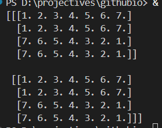

最后把这个化成图，再按帧写成gif就得到了题目。

接下来我们想办法一步步逆回去。首先是要把gif解析成一帧一帧的，再按帧读取条形图内容，最后把条形图按高度转化成一个32位长数据，取转置得到一个长为32宽为X的（X是帧数）二维数组，把二维数组反向计算成y，最后用soundfile即可获得结果。

开写：

```python
import numpy as np
import librosa
from PIL import Image, ImageSequence
import soundfile as sf

TARGET='flag-1'

num_freqs = 32
quantize = 2
min_db = -60
max_db = 30
fft_window_size = 2048
frame_step_size = 512
window_function_type = 'hann'
color_pixel = (0, 0, 255)
white_pixel = (255, 255, 255)


img=Image.open(TARGET+'.gif')
frames=[]

for frame in ImageSequence.Iterator(img):
    array = np.array(frame.convert('RGB'))
    is_blue = np.all(array == color_pixel, axis=-1)
    single_frame = is_blue.astype(np.uint8)
    #只保留每4位的第4个（即索引3,7,11,...,127），共32个数据
    ext_frame=[]
    for i in single_frame:
        _=[]
        for index,j in enumerate(i):
            if index%4==3:
                _.append(j)
        ext_frame.append(_)
                
    frames.append(ext_frame)

#到此为止frames是一个三维数组，第一维存帧，第二维是纵向数据，第三维是32频中的某一频在某一db的数据，接下来还原每一帧的单频数据
new_frames=[[list(i).count(0) for i in np.array(singleframe).T]for singleframe in frames]

#得到的new_frames是以86为无声基础的，如果按步测试很容易发现原来的是按-54，所以变为ndarray之后用32减全部数:

new_frames = np.array(new_frames)
new_frames = 32-new_frames

print(len(new_frames))

#接着还原成音频即可

mel_spec=new_frames.T
print(mel_spec.shape)
sample_rate = 22050

power_spec = librosa.db_to_power(mel_spec, ref=1.0)
print(len(power_spec))

# S 是功率谱
S = librosa.feature.inverse.mel_to_stft(power_spec, sr=sample_rate, n_fft=fft_window_size)

# 【关键修复】将功率谱 S 开方，得到幅度谱 S_magnitude
S_magnitude = np.sqrt(S)
print(len(S_magnitude))

# 使用修正后的幅度谱进行Griffin-Lim重建
y_reconstructed = librosa.griffinlim(S_magnitude, n_iter=64, hop_length=frame_step_size, win_length=fft_window_size, window=window_function_type)

print(len(y_reconstructed))

sf.write('reconstructed.wav', y_reconstructed, samplerate=sample_rate)
```

这个程序难受在调试了三个多小时，要么泡出来的结果会只有揪的一声，要么会爆说有10G内存没法分配。后面步进调了好久，总感觉frame没缺，就是320帧。结果最后我关了chrome和vsc，单用命令行跑就跑通了。这道题真卡硬件啊，还以为是我写错了（

那么可以听到flag-1是Never gonna give you up（你被骗了），flag-2是一剪梅（卤蛋.mp4）

!!! Warning "严重修复建议"
    希望明年这道题的hint可以多一条：建议清理出内存后运行。毕竟像我这样喜欢把好多个工程开开开开起来的跑完发现爆内存以为是自己写的数组出错了。不过倒是有更难的解法就是把这个gif拆成好几帧再拼一起，就是报错容易劝退，比如把我劝退了（

> 诶，明年的ctf能不能有雑踏、僕らの街呢
>

### Challenge C

怎么又是numpy题（恼

flag: `0ops{power_1s_a11_y0u_n55d}`

首先下载附件是一个npz文件，用ide简单交互一下

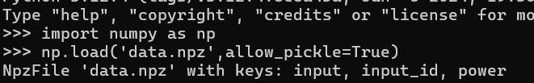

发现有三列数据`input`, `input_id`, `power`，全部转list

```python
import numpy as np
data = np.load('timeandpower.npz', allow_pickle=True)

print(data)

print(list(data['input']))
print(list(data['input_id']))
print(list(data['power']))
```

哇，输出了一坨，挨个分别看，大致是input是一堆字符，input_id是一堆int，power是一堆float。总之先把这一堆存成文件：

```python
np.savetxt("timeandpowerinput.npy", data['input'], fmt='%s', delimiter=',')
np.savetxt("timeandpowerinput_id.npy", data['input_id'], fmt='%s', delimiter=',')
np.savetxt("timeandpowerpower.npy", data['power'], fmt='%s', delimiter=',')
```

分析大致得到如下内容：

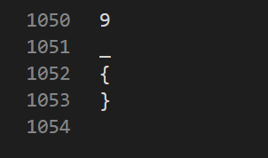 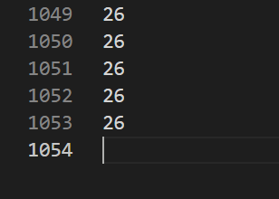 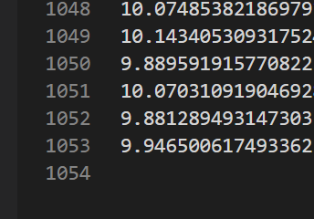

可以看到，input内容是a-z,0-9,_{}，input_id内容是0~26，每个数字39（=26+10+3）个，共27\*39=1053行，power就是1053行数据，每行有100个数据。合理猜测input_id告诉我们flag长度为27，power告诉我们正确的input，input是编码集。

因为是上交大的题，开头是0ops，那考虑先对应一下0ops，那么按编码集，前五个字符应该对应26,14,15,18,37。因为power也是1053行数据，所以每39个划分为一组，这一组3900个数应当能按某种规律解出一个对应的数字。

大概扫了一组的数据，发现这一组数据大多数都是10或者9，只有一个是11，ctrl+F发现11全文有505个，用脚本跑一下：

```python
with open("timeandpowerpower.npy",'r') as f:
    x=f.read().split('\n')

nx=[]
for i in x:
    j=i.split(',')
    nx.append([float(k) for k in j if k])

ns=[]
for i in nx:
    for index,j in enumerate(i):
        if j>11:
            ns.append(index)

print(ns)
```

得到结果是很整齐的一片片的数据：

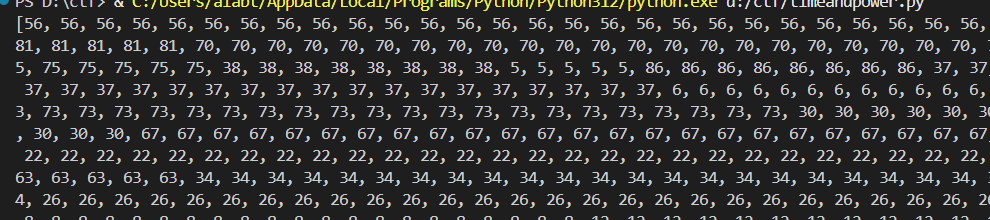

感觉方向应该对了，但是信息有点多，现在信息包括：11在一组里出现的次数、11在一组里出现的位置和没出现的位置、11存在的index。提取出unique发现长度只有21，感觉单一个unique肯定是漏信息了。而且还是想搭边功率，比如可能正确的一次功率最低之类的。

灵感乍现了，看了一下基本10.8以上的数据是每3900个数据里面都会出现的，题目hint说让我画图，那我是不是可以认为图里面会有脑袋尖尖的或者脑袋凹凹的，对应的结果是不是极差或者标准差？

比如说标准差的话，用这个脚本画了前四个的图，最高点和前面的11在一组里存在的index是相同的：

```python
import numpy as np
import matplotlib.pyplot as plt

data = np.load('timeandpower.npz')
power = data['power']
power = power.reshape(27, 39, 100)


i = 0
t = power[i]

stds = t.std(axis=0)
max_std_index = np.argmax(stds)
y_values = t[:, max_std_index]
x_values = np.arange(39)
plt.figure(figsize=(10, 5))
plt.plot(x_values, y_values, marker='o')
plt.title(f"t{i}")
plt.xlabel("times")
plt.ylabel("P")
plt.grid(True)
plt.tight_layout()
plt.show()
```

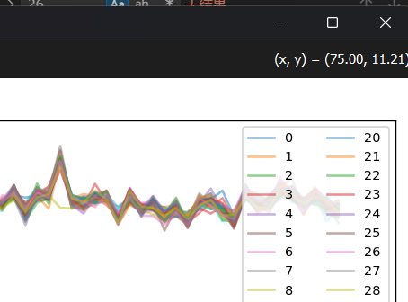

（这里以i=3为例了）

那这个研究方向就没毛病，和之前的吻合了，只不过之前只能探测有大于11数据的，现在可以把所有组数据都探测出来。

问题又来了，得到这个列表之后我干啥呢，取余39也不是正确的27。

把这些标准差最大的数扒拉出来再画个图：

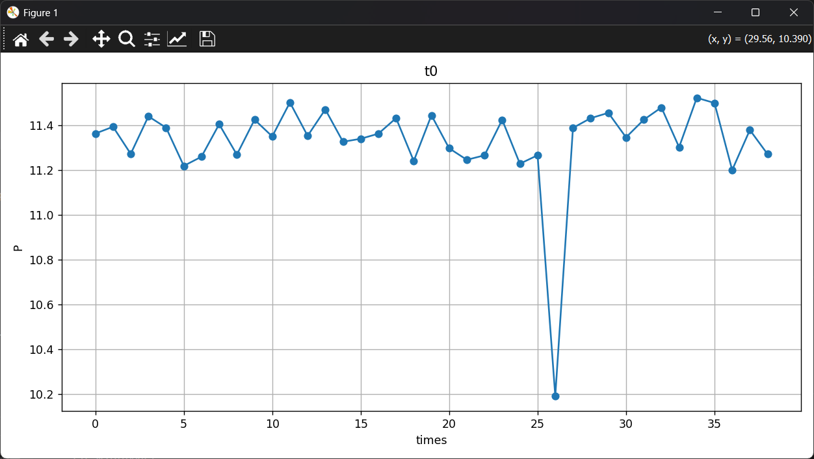

wow这个图可太明显了，东非大裂谷，和我刚才的猜想有点对上了：刚才我找11.的时候就发现第一组里面恰好第27个没有11.，其余的38个都有11.，可惜第二组只有9个11.，以为是思路错了结果思路是对的，只不过不是找11而是找标准差最大的那一组。

那就可以直接写脚本了：

```python
import numpy as np

p = np.load('timeandpower.npz')['power']
dicts = r'abcdefghijklmnopqrstuvwxyz0123456789_{}'
s=''
for i in range(0,27*39,39):
    cha=p[i:i+39].std(axis=0)
    maxi=np.where(cha==cha.max())[0][0]
    print(maxi)
    ss=p[i:i+39][:,maxi]
    mini=np.where(ss==ss.min())[0][0]
    s+=dicts[mini]
print(s)
```

得到flag。


