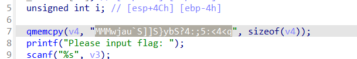
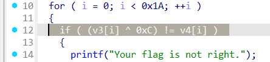
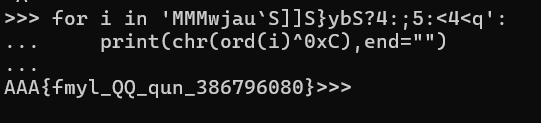
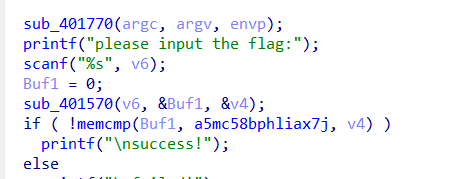

# CTF101 REV Lab1

## 3240102120

### Task1

课上用了四种参数，-E、-S、-c和不加。

这里分别进行 `gcc -E hello.c -o hello.c.i` 、 `gcc -S hello.c` 、`gcc -c hello.c` 、`gcc hello.c -o hello`，可以分别得到hello.c.i、hello.s、hello.o和hello.exe。

其中.i是预处理文件，里面堆了一堆include内容和一小点点的int main，main里面也没有进行处理。

.s是汇编文件，就是刚才的程序的汇编版本，因为我本学期选修过汇编语言所以不再作熟悉工作。

.o是编译文件，但是没有做链接。在.o里面，对printf的跳转地址是0，所以理论上这个.o还不能执行。因此需要进一步进行链接。

最终的hello就是一个elf可执行文件，可以直接执行来输出hello world! 。

### Task2

IDA是老朋友了，这里按要求回答问题：

功能：最重要的就是反汇编，把elf或者pe文件反汇编成汇编。其次就是反编译，把牛马都不乐意读的汇编给写成伪C代码，最起码读起来没汇编难受就是了。然后这里面还有几个功能比较好用，一个是汇编流程图，感觉这个功能救过我一命，之前有一次打也不哪道题的时候体会深刻，要是没流程图，我觉得我可能已经迷失在jne的海洋里了；另外一个就是debug。总的来说功能很强大，能做到这种程度的软件真不多。

（后期补充一下：想起来什么时候用流程图了，当时和北京一哥们一块爆classin，想实现一下防撤回，搞忘记是做什么了，他最开始拿到的内容是纯汇编，就是那一大坨一大坨的三元运算，在jne的海洋中徜徉了不知道多久，后来改用了流程图稍微清晰了点，最后把“小A 撤回了一条消息”给魔改成了“小A”，这个用户名逻辑说啥也没找到。这也是第一次汇编给我留下的心理阴影）

快捷键：GNU（不是），就是跳转、重命名和还原。这是调试过程中的事。丢程序进去之后ctrl+P看流程图，tab能在流程图和伪代码之间反复横跳

实用技巧倒是没有什么，就是可以优先看伪代码但是不能只看伪代码，有必要的时候要重命名一些奇妙小变量

gdb比较新，我也是学了系统一和汇编之后才开始接触，不过因为之前python是主战场，也没少打断点查变量，所以对gdb的感觉就是命令行版的断点器。以下也是按盘回答问题。不过没有尝试gef和pwndbg插件，打算晚点再了解

- 打断点b，可以跟行数也可以跟函数名，汇编里面可以跟label，作用就是在这打断点，执行到这一步就停；
- 运行r，就是运行程序
- 继续c，跑程序到下一个断点
- 步进n或者s，区别就是如果有函数调用，n只调用不进函数体，s直接执行函数体
- 执行到until，如果是循环体就执行到跳出循环体，如果不是要跟行号，执行到行为止。
- 退出q

### Task3

exp2: 首先用IDA打开程序，能直接看到比较的内容：



再看比较方式是flag位异或0xC和那一串比，所以只要异或回来就行了





得到flag。`AAA{fmyl_QQ_qun_386796080}`

<br>

exp3: 用IDA打开程序，可以看到逻辑是用401570函数比较的



追踪到401570，可以看到逻辑一大串。大致看下来就是用来做base64编码的。所以实际上需要找的是一串存好的base64编码。返回main追踪a5mc58bphliax7j得到db '5Mc58bPHLiAx7J8ocJIlaVUxaJvMcoYMaoPMaOfg15c475tscHfM/8=='。又因为是自定义符集编码，所以再追踪aQvejafhmuyjbac得到'qvEJAfHmUYjBac+u8Ph5n9Od17FrICL/X0gVtM4Qk6T2z3wNSsyoebilxWKGZpRD'

有点懒得写脚本了，让AI替我写一个：

```python
#! 本脚本由AI生成，极可能存在查重率不过的情况，并非抄袭<s>（而是偷懒）</s>！

custom_table = "qvEJAfHmUYjBac+u8Ph5n9Od17FrICL/X0gVtM4Qk6T2z3wNSsyoebilxWKGZpRD"
encoded = "5Mc58bPHLiAx7J8ocJIlaVUxaJvMcoYMaoPMaOfg15c475tscHfM/8=="

import base64

# 创建反向映射表
decode_map = {c: i for i, c in enumerate(custom_table)}

# 清理填充
encoded_clean = encoded.rstrip("=")
padding = len(encoded) - len(encoded_clean)

# 将每个字符映射为其 6 位整数
bit_stream = ""
for c in encoded_clean:
    if c not in decode_map:
        raise ValueError(f"Illegal character {c}")
    val = decode_map[c]
    bit_stream += format(val, "06b")

# 处理 padding（每个 = 去掉两个 bit）
bit_stream = bit_stream[:len(bit_stream) - padding * 2]

# 每 8 位一组转为字节
decoded_bytes = []
for i in range(0, len(bit_stream), 8):
    byte_bits = bit_stream[i:i+8]
    if len(byte_bits) == 8:
        decoded_bytes.append(int(byte_bits, 2))

# 输出结果
flag = bytes(decoded_bytes).decode(errors="ignore")
print("Decoded flag:", flag)
```

运行脚本就可以得到flag：`NSSCTF{a8d4347722800e72e34e1aba3fe914ae}`
