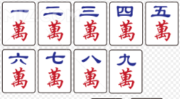
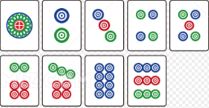
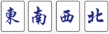
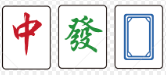
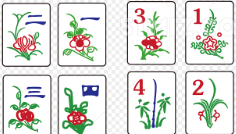

# 一、麻将基础内容及基本规则

麻将是发源于中国的古代四人博弈游戏，由一百张以上的小骨牌组成，通过打牌、鸣牌、摸牌来组成牌型获得胜利。麻将的核心就是博弈，根据他人出牌来尝试反推他人手牌，以防止自己打牌输给他人。  

麻将文化博大精深，由于发展时间很长，导致中国各地和东亚文化圈内流传着各种不同的麻将规则。本文仅收录部分规则，在后文做详细解释。  

## 1. 牌面介绍

由于各地规则不一，麻将牌型也不一，但所有麻将均有以下108张、27种、3色牌：

一万\~九万，统称万子；  

  

一索\~九索（或称一条\~九条），统称索子（或称条子）；  

一筒\~九筒（或称一饼\~九饼），统称筒子（或称饼子）。

以上牌每种有4张，共27*4=108张。这一百零八张牌就是麻将牌的核心，所有麻将均包含这一百零八张牌。其中，“一筒”有称“大饼”、“幺饼”、“幺筒”；“一索”有称“幺鸡”、“幺索”、“幺条”；“一万”有称“幺万”。  

我们称以上的牌为“数牌”。  

除此以外，常规麻将还包含额外的28张牌。因此常规麻将共包含108+28=136张牌。额外的28张牌包括：  

东风、南风、西风、北风

红中、发财、白板

以上牌统称“字牌”。每种牌有4张，共28张。其中“东风”、“南风”、“西风”、“北风”统称“风牌”；“红中”、“发财”、“白板”统称“元牌”或“三元牌”。  

除此以外，部分地区还有“梅兰竹菊”、“春夏秋冬”牌等。

由于“梅兰竹菊春夏秋冬”应用范围较小，因此TNT公式战不会采用这四种牌。  

至此，你应该已经了解，136张牌的麻将可以被分为34种、5色（万子、筒子、条子、风牌、元牌）、2类（数牌、字牌）。除这种分类方式外，还有以下两种类别称呼：  
- 幺九牌：指一万、九万、一筒、九筒、一索、九索六张数牌及七张字牌。
- 中张牌：除幺九牌外的所有数牌

相较于扑克牌，麻将中牌面较多，需要新手玩家反复熟悉记忆，以免出现上桌数点的情况。  

  

## 2. 麻将游戏流程及目标

麻将一般为四人游戏，也有三人玩法。各地麻将规则也不一，但所有麻将基本都遵循一个规则：凑牌型。  

麻将游戏流程如下：  
1. 确定庄家，规则不一，可以座位面东为庄、摇骰子为庄、抽签为庄等等。  
2. 从庄家开始摸牌，每人摸13张牌作为手牌；  
3. 从庄家开始出牌循环。任何人出牌前需要在牌山中摸取一张牌加入手牌或鸣牌，保证自己的牌在非出牌阶段数量总是13；  
4. 出牌。出牌顺序一般为东风、南风、西风、北风，即逆时针；  
5. 某人在摸牌时摸到需要的牌，或是别人打出了需要的牌，该人和牌获得胜利，游戏结束。  
6. 按规则顺延庄家或重新选取庄家，进行下一轮游戏。  

麻将游戏目标为：将手牌凑成4\*3+2的形式。这其中，3指的是“顺子”、“刻子”或“杠子”，它们统称“面子”；4指的是4副“面子”；2指的是一个对牌，称“雀头”。由于4\*3+2=14，因此和牌总是在摸牌后，或是某人打出需要的牌后发生。  

麻将牌型大小基本由面子决定，因此凑面子是麻将的核心。以下是面子的介绍：
- 顺子：对数牌而言，同花色的数牌数字连续3张算为顺子。例如：三万、四万、五万；七筒、八筒、九筒。
- 刻子：对任意牌而言，连续三张相同的牌算为刻子。例如：二索、二索、二索；东风、东风、东风。
- 杠子：对任意牌而言，连续四张相同的牌算为杠子。例如：幺鸡、幺鸡、幺鸡、幺鸡；发财、发财、发财、发财。但杠子必须鸣牌才可以算杠子，否则算作一副刻子+单张牌。  

当某次打出牌后，你的牌只剩某1张就能凑成4\*3+2的牌型了，那么就称你“听牌”了。可以称你“听”你需要的牌。听牌不一定只有一张，也可以有两张以上。例如以下牌型：

一万 二万 二万 三万 三万 五筒 五筒 东风 东风 东风 / 碰\[南风 南风 南风\]  

以上牌既可以得到一张一万和，也可以得到一张四万和。

大部分地区麻将均无需喊出自己听牌。部分麻将喊门前请的听算一种番（如日麻）。部分麻将喊听后不能再更改自己的手牌，只能摸牌并打出这张牌。具体规则会在第二章介绍。  

当一次摸牌后手牌凑成了4\*3+2的形式，或是某人打出一张牌，这张牌可以和你的手牌凑成4\*3+2，那么你可以选择和牌，获得本场游戏的胜利。摸牌和牌称为“自摸”，其他人打牌和牌称为“放铳和”、“荣和”、“点炮”等。  

??? tips "为什么“选择”和牌而非立即和牌？"
    麻将是一个靠凑牌获胜的游戏，凑出的牌型越整齐赢得的点数越多。而有时听牌不止一张，和牌A不如和牌B得的点数多，因此有人打出牌B时可以选择不和，等一下牌A和牌。  

  

## 3. 鸣牌介绍

在麻将过程中，若只允许玩家一味摸牌打牌，那么麻将只能是一种运气游戏。因此麻将允许玩家获得其他玩家打出的牌。这种行为称为“鸣牌”。

鸣牌有三种，以下是介绍：  
- 吃：上家打出一张牌，如果手里恰好有两张牌可以与该牌组成一个顺子，那么可以进行“吃”。
- 碰：任意一家打出一张牌，如果手里恰好有两张牌可以与该牌组成一个刻子，那么可以进行“碰”。
- 杠：分为明杠、暗杠和补杠三种。
> - 明杠：任意一家打出一张牌，如果手里恰好有该牌组成的刻子，那么可以进行“明杠”。一般只称“杠”。
> - 暗杠：如果手中有四张相同的牌，那么可以进行“暗杠”
> - 补杠：如果自己曾碰过牌，自己的手牌中又有这张牌，那么可以“补杠”。
>  
鸣牌只在其他玩家打出一张牌后进行（暗杠和补杠除外）。如果一人打出牌后无人鸣该牌，那么其下家可以继续摸牌；如果有人鸣牌，则此人获得该牌，然后从鸣牌者开始继续游戏。  

鸣牌后，需要将参与鸣牌的牌亮出在桌面上，作为一副面子。例如，A打出一张二索，B手中有三张二索，则B可进行“杠”（明杠）。B亮出三张二索，获得刚刚打出的二索，之后从B开始游戏继续。玩家一局中最多可以进行除“补杠”外的鸣牌操作4次，因为每鸣一次牌，玩家就获得一副面子，而和牌条件是获得4副面子。  

除杠以外，玩家鸣牌后需要立刻打出一张牌。杠牌后，玩家从岭上（部分地区规则是牌山下一张或是牌山最后一张）中摸一张牌，然后打出一张牌。

??? note "一些鸣牌例子，供新手理解"
    - A的下家是B。B手中有六筒、八筒。A打出了一张七筒，B选择“吃”，B亮出六筒、八筒并获得七筒，然后B打出了一张东风。C继续摸牌打牌；

    - A的对家是B。B手中有六筒、八筒。A打出了一张七筒，B不能选择“吃”。

    - A的对家是B。B手中有两张红中。A打出了一张红中，B选择“碰”，B亮出两张红中并获得红中，然后B打出了一张六筒。C继续摸牌打牌；

    - A的对家是B。B手中有两张五索。A打出了一张五索，由于B还有一张四索一张六索，因此B选择不拆开该顺子，B放弃“碰”。注意B全程没有说任何话，C作为A的下家照常摸牌打牌；

    - A的上家是B。B手中有三张一万。A打出了一张一万，B选择“杠”，B亮出三张一万并获得一万，然后B从岭上摸了一张牌，打出后，C继续摸牌打牌；

    - A的下家是B，B的下家是C。B的手中有二万、三万、五筒，C的手中有六筒、七筒。A打出了一张一万，B选择“吃”，然后B打出了五筒，C没有摸牌，继续选择“吃”，然后C打出一张牌，D继续摸牌打牌；

    - A的对家是B。A手中有两张二万，B的手中有两张东风。A打出了一张东风，B选择“碰”，然后B打出了一张二万，A也选择“碰”，然后A打出一张牌，C作为A的下家继续摸牌打牌。

    - B摸牌时发现手牌有四张南风，B选择“暗杠”，亮出后（部分地区规则是不亮出）B从岭上摸得一张牌，然后打出一张牌，C继续摸牌打牌；

    - B摸牌时发现手牌中有四张五索、一张六索一张七索，但由于这相当于一个刻子和一个顺子，B放弃暗杠，继续打牌。过了几巡，B为了防守打出了七索，于是顺子被拆，因此B选择在打出七索前进行“暗杠”，从岭上摸牌后打出了七索；

    - A的对家是B。B手中有两张红中。A打出了一张红中，B选择“碰”，B亮出两张红中并获得红中，然后B打出了一张六筒。C继续摸牌打牌。过了几巡，B摸牌摸到了红中，由于留在手中凑不出顺子，因此B选择“补杠”，B将红中放在亮出的三张红中处，然后从岭上摸了一张牌，打出一张牌后游戏继续。

!!! warning 
    注意，当某张牌可以和牌时，若手中的牌需要“吃”这张牌才能和，即使不是你的上家打出的牌，你也可以和牌。 

  

至此，你应该已经学会了打麻将。它就是摸来一张牌，再打出一张自己不需要的牌（或者因为防御打出别人都不要的牌），最终想办法凑成4\*3+2的牌型。接下来，请尝试判断以下这种牌型（已听牌）听哪张牌：

一万 一万 一万 二万 三万 四万 五万 六万 七万 八万 九万 九万 九万 / 无鸣牌

  