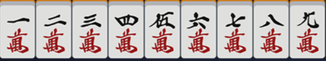
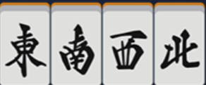

# 二、日本麻将（マージャン）规则介绍

日本麻将，日语称マージャン，又称立直麻将。难度属于麻将天花板，可以与国标麻将、哈尔滨麻将平起平坐。立直麻将也是较为流行的一种麻将规则，流传度相对较四川麻将差。

由于规则标准化与传播均依靠友邦，因此很多术语请尽可能地使用友邦语言或中文音译，以减少歧义，下文首次出现的名词也会标注日文假名。事实上，立直麻将中许多术语均为音读，因此大部分情况下与中文字发音相近甚至相同。  

因为立直麻将的规则相对完善且有一套几乎完整的竞技体系，且立直麻将削弱了运气成分对游戏带来的影响，因此更适合作为麻将比赛规则。故TNT公式战决定以日麻为主要游玩方式。  

## 1. 牌型简介

### (1). 牌面 

立直麻将（以后简称日麻）使用标准的136张麻将牌（はい），名称与普通麻将基本相同。不过日麻采用了一套标准牌面，以下是它们的图片：

万子（マンズ・ワンズ）  
  

筒子（ポンズ）  
  

索子（ソウズ）  
  

风牌（フォンパイ・かぜはい）  
  

三元牌（さんえんはい）  
  

同样，万、筒、索可以统称数牌（シュパイ），而风牌和三元牌可以合称字牌（ツーパイ・じはい）。除此以外，还可以称数字为一、九的数牌为老头牌（ロートーはい），老头牌和字牌合称幺九牌（ヤオチューはい）。  

按规定，麻将牌是有大小顺序的。一般是按万\<筒\<索\<风\<三元的顺序来的。其中数牌大小按数字决定，风牌中，按东、南、西、北的顺序；三元牌中，按白、发、中的顺序。线上麻将会自动按这个顺序摆好牌，线下麻将中建议玩家按此顺序摆牌，但为了思考方便不按此顺序摆牌并不违规。  

为了方便，在传递牌谱时，可以用一些简称来代替万、筒、索、字牌。以下是他们的对照表：

| 名称 | 表示方式 | 名称 | 表示方式 |
| :--: | :--: | :--: | :--: |
| 一\~九万 | 1\~9m | 西风 | 3z |
| 一\~九筒 | 1\~9p | 北风 | 4z |
| 一\~九索 | 1\~9s | 白板 | 5z |
| 东风 | 1z | 发财 | 6z |
| 南风 | 2z | 红中 | 7z |

除此以外，用“/”来分开手牌与副露，每个副露用中括号括起；表示某张牌是和的牌时，放在牌型最后，用逗号与前面的牌隔开，然后用中括号括起。必要时在后面补充和牌方式，例如“立直一发自摸”

例如，在[第一章末尾](./1.0.md/#end-of-1)的练习牌可以这样表达：

1m 1m 1m 2m 3m 4m 5m 6m 7m 8m 9m 9m 9m

### (2). 牌的角色

在桌面上的牌根据位置不同有不同的称呼。  

牌局刚刚开始时，在桌面上会有四摞码好的、两两叠起的牌堆，称之为牌山（はいやま）。每次开局时，每人面前将有一摞牌山，每座牌山有17叠、34张牌。开局的分牌（はいぱい）和牌局中的摸牌（ツモる）都是从牌山摸取的。  

打牌时，需要将牌码在自己面前，这一区域的牌称为牌河（ホー・かわ）。  

摸到手中不亮出的牌称为手牌（てはい）。初始有13张，在自己摸牌后出牌阶段有14张，鸣牌导致有副露后手牌数会减少，但一定保证手牌一定是 $ (4-x) \times 3 + m $ 的形式，其中 $ x $ 是副露数；非出牌时 $ m $ 为 $ 1 $ ，摸牌后出牌时为 $ 2 $ 。如果手牌数大于此，称为大相公（ダーパイ）；如果手牌小于此，称为小相公（ショーパイ）  

鸣牌后，亮出的牌需要放在自己右手侧，这一区域的牌称为副露（フーロ）。要注意暗杠时，虽然暗杠牌也需要摆在副露区，但不算为副露。  

除暗杠外，从未鸣过牌的状态叫做门前清（もんぜんきよし）。

在日麻中，牌山的最后14张牌不在对局中使用。这14张牌被称为王牌（ワンパイ）。王牌通俗的叫法为岭上牌（リンシャンパイ）。  

和牌时的四副组牌称面子（メンズ），一副对牌称雀头（スズメ）。

### (3). 行为

牌局开始后，需要从牌山一处摸牌。摸牌后进行打牌（きる）或称切牌。有人打出牌符合规则可以让你吃（チー）、碰（ポン）、杠（カン）时，可以进行鸣牌（なく・くう）。当只剩一张牌就可以和牌（ホーラ）时，称为听牌（テンパイ）。和牌时，如果是自己摸到牌和牌，称为自摸（ツモ），他人打出牌和牌则为铳和（ロンホー）。由于铳和写作「栄和」，因此也叫做荣和。  

在日麻中，门前清状态下听牌可以选择宣布立直（リーチ），立直后，玩家不允许再改变自己的牌型，只允许摸切，即摸牌后立刻打出。直到有人打出你和的牌，或是你摸到自己和的牌。  

  

## 2. 什么是役

役种是日麻中的重要规则。日麻中和牌除了要满足 $ 4 \times 3 + 2 $ 的牌型以外，还必须要让牌型满足至少1种役，否则不能和牌。  

关于役种，根据获得难度，每个役种都有对应的番数。因此，一般以番数来分类役种。役种大部分都不是互斥的，也就是说，你可以同时和出多个役种。  

役种详见[附录1：日麻役种表](./app.1.md)。  

役种看似杂乱无章，实际上可以通过经验积累记住它们。在短时间内，玩家可以先记住“立直”和“断幺九”，因为他们都是比较容易和出的牌。除此以外，还可以通过获得三元牌或场自风牌刻子来占役。  

由于名称即是**立直**麻将，可以说明立直在本麻将规则中的重要性。立直要求是门前清状态下听牌（暗杠不破坏门前清），听牌后即可选择立直（也可以选择默听）。立直需要付1000点作为供托，本局和牌者获得场上所有立直供托。立直后，不允许再更改已有手牌，只允许摸切。  

简单浏览役种后，你会发现相当一部分役种要求门前清，或是副露会减一番。因此，立直麻将不提倡鸣牌副露，请尽可能地减少副露次数。  

上文说到役种**大部分**不互斥，因此一定会出现互斥的情况。无论何种情况，均按照“高点法”计算。常见的互斥为七小对与一杯口、二杯口互斥；三色同顺成立互斥等等。  

??? note "一个简单的互斥牌型"
    

    2m 2m 3m 3m 4m 4m 5m 5m 6m 6m 7m 7m 8m, \[8m\] 立直自摸朵拉0

    

    这里牌可以按简单的七对子+清一色+断幺九来算，也可以按二杯口+清一色+断幺九来算。由于二杯口三番，七对子二番，因此该牌型记为二杯口而非七对子。要注意七对子的描述是“七个对子牌”，而二杯口是“两对相同的顺子”，因此拆分方式不同，不能同时满足。  

建议玩家尽快将役种背全，避免出现冲动副露后不知怎么和牌的情况。  

  

## 3. 什么是振听

振听（フリテン）也是日麻中的重要规则之一。它限制了部分听牌。  

振听分为三种：舍张振听、同巡振听和立直振听。振听成立时，即使有人打出了你和的牌，也不允许和牌。  

以下是三种振听的详细介绍：  

**舍张振听（きるフリテン）**，指听牌时听自己曾打出的一张牌。打出的牌不仅包括牌河，还包括其他人鸣过自己的牌。舍张听牌容易出现的误区是自己听无役牌振听。举例说明：  

2m 3m 2p 3p 4p 3s 3s 3s 5s 5s / 吃\[6s 7s 8s\]

很明显，上述牌型只能和断幺九，因此正常只听4m一张牌。但同时，虽然1m不能使这个牌型和牌，但1m同样可以使这副牌形成4\*3+2的牌型，因此1m也属于听牌范围，此时若玩家打过1m这张牌，那么也会成立舍张振听。  

舍张振听是永久振听，也就是只要玩家不换所听的牌，那么就永远不能荣和。但舍张振听允许玩家自摸和。比如上述牌型，若玩家自摸4m，同样可以和牌。  

舍张振听限制了玩家的出牌，旨在敦促玩家考虑清楚后再打牌，不可随意换张；同时也给了其他玩家防御的机会，可以考虑安全牌。  

 

**同巡振听（同巡内(どうしゅんない)フリテン）**，指若有人打出了玩家所听的牌，但玩家没有选择和（或无役导致的不能和），则在下次摸牌前，其他人再打出玩家听的牌都不能和牌。同巡振听只在非立直状态下成立。  

同巡振听是短期振听，只要玩家再次摸起一张牌，就可以结束同巡振听。因此同巡振听与自摸和冲突，无需讨论同巡振听是否限制自摸和。  

同巡振听同样容易出现舍张振听的误区。仍使用舍张振听的例子，若有人打出了一张1m，则在下次玩家摸牌前，若有人再打出一张4m，玩家不能和此牌。因此，玩家需要提前考虑好自己所听的牌，然后再上听。  

??? question "振听存在的意义？"
    同巡振听和舍张振听要求玩家减少边张听牌，或是限制了断幺九的听牌。  

 

**立直振听**，指玩家宣布立直后，若有人打出你和的牌，而你选择放弃和牌，则你本局不能再和牌。  

立直振听是永久振听，它要求玩家立直后必须惯性和牌，即和第一张可和的牌。这也限制了玩家的立直行为。部分玩家会出现追大牌的情况，有时为了追大牌放弃和小牌，而立直振听的规则就是为了规避这种情况。因此玩家如果对牌山没有信心，可以考虑放弃立直，默听和牌；或是晚巡立直。  

 

??? abstract "注意"
    振听和牌是新手常见的低级错误，新手在听牌前务必记得检查自己将听的牌是否使自己振听，并谨慎选择立直。  

  

## 4. 细节规则及术语补充

为了介绍规则方便，我们先进行术语补充。  

| 中文术语 | 日文对照（仅平假名） | 介绍 |
| :--: | :--: | :--: |
| 庄家 | しょうか | 每局坐东风位的玩家，由ta开始出牌，和牌时支付或收取点数比其他玩家更多 | 
| 闲家 | かんか | 每局除庄家外的三家 |
| 上家 | うえのか | 坐自己左手边的人，比自己先出牌 |
| 下家 | したのか | 坐自己右手边的人，比自己后出牌 |
| 对家 | たいのか | 坐自己对面的人 | 
| 空听 | そらみみ | 自己听的牌余0张 |
| 绝一门 | ぜったい | 不含字牌、三种花色中只含有两种 |
| 东风战 | どうふ | 对局长度的一种，每人可坐1次庄 |
| 半庄战 | はんそう | 对局长度的一种，每人可坐2次庄 |
| 全庄战 | ぜんそう | 对局长度的一种，每人可坐4次庄 |
| 连庄 | れんそう | 庄家和牌或庄家流局听牌时，下一局仍是庄家坐庄 |
| 轮庄 | りんそう | 闲家和牌或庄家流局未听牌时，下一局由本局南家坐庄 |
| 本场 | ほんば | 流局或庄家和牌，本场+1 |
| 宝牌/朵拉 | ドラ | 每局指出的可在和牌时加番的牌 |
| 赤宝牌/赤朵拉/阿卡 | あかドラ | 红色的5m、5p、5s，作用与宝牌相同 |
| 里宝牌/里朵拉 | りドラ | 立直和牌后，宝牌指示牌下的牌成为里宝牌指示牌，指示里宝牌，与宝牌作用相同 |
| 诈和 | チョンボ | 宣布和牌后发现出现无役、振听、非和牌牌型的情况 |
| 停和 | あがりほうき | 由于看错牌、听错牌而导致自己本不该和牌时喊出和牌的情况 |
| 巡 | ぐるりと | 从1人开始打牌到此人第二次摸牌结束算为1巡，每鸣牌1次，从鸣牌后开始算为新1巡 |
| 单骑 | タンキ | 听牌时单听一张未成对的雀头 |
| 边张 | ペンチャン | 听牌时为12听3或89听7 |
| 中张 | チュウチャン | 非幺九牌 |
| 嵌张 | カンチャン | 听牌时听顺子的中间一张 |
| 双碰 | シャンポン | 听牌时听两个对子成刻子 |
| 两面听 | リャンメン | 听牌时听顺子的左右两张 |
| 一向听 | イーシャンテン | 差1张牌就能听牌的状态 |

接下来我们介绍一些细节规则：

#### 初始点数
一般的初始点数均为 $ 25000 $ 。

---

#### 风位
每一个完整游戏局内，玩家座位都唯一确定，每个位置都被用风来命名，称为**风位**。一般麻将机没有固定的东风位，因此可以由玩家自行决定哪侧为东。东风位玩家的下家是南风位，上家是北风位，对家是西风位。东风位玩家是完整游戏局内第一个坐庄的玩家。

---

#### 风家、本场
每一局内都有本场的**场风**和玩家的**自风**，统称为**风家**。场风由东位玩家坐庄次数决定，自风由自己与本局坐庄玩家的相对位置决定。由于风位和风家容易混淆，请务必仔细辨析两者间的区别。

**场风**由东风位玩家坐庄次数决定。坐庄次数只考虑轮庄后上庄，连庄时次数不增加。东风位玩家坐庄1次为东风场，2次为南风场，以此类推。

**自风**由自己与本局坐庄玩家相对位置决定。本局坐庄玩家是东家，坐庄玩家的下家是南家，上家是北家，对家是西家。

**本场**是在同场风局下的累加局。当一局流局，或是庄家和牌时，本场数+1。本场数初始为0。当本场不为0时，有人和牌，其他人就要多付 $ 300 \times 本场数 $ 的点数。荣和时由放铳者付全部，自摸和时每人付 $ 100 \times 本场数 $ 。

在讨论牌局时，可以称**Ax局m本场**。其中 A 是该局场风， x 是该场风下的第几局， m 是本场数。例如南风位第一次坐庄的局可以称 东2局0本场。流局一次且南风位没有听牌，则西风位坐庄，称东3局1本场。

---

#### 宝牌、赤宝牌、里宝牌
**宝牌**又称悬赏牌，和牌时若牌内包含宝牌则可以加番，有几张加几番。

宝牌由宝牌指示牌确定。每局开始时，翻开岭上牌的第五墩在上的牌作为宝牌指示牌。这张牌的下一张就是宝牌。这里的“下一张”仅在同花色范围内循环执行。可以参考以下例子：

| 宝牌指示牌 | 宝牌 |
| :--: | :--: |
| 2m | 3m |
| 9m | 1m |
| 1p | 2p |
| 9s | 1s |
| 1z（东风） | 2z（南风） |
| 4z（北风） | 1z |
| 5z（白板） | 6z（发财） |
| 7z（红中） | 5z |

**赤宝牌**是麻将牌提前内置的牌，只有三种：5m、5p、5s。也就是说，实际上一副标准日麻牌里有三张5m和一张红5m，以此类推。一般牌均为三赤，偶见四赤牌，第四赤是5p。赤宝牌无论何时均按宝牌处理。

**里宝牌**是类似宝牌的牌，当立直后和牌时，就可以翻开里宝牌指示牌来获得里宝牌。里宝牌指示牌是已翻开的宝牌指示牌压住的那一张，同样指示其下一张为里宝牌。里宝牌与宝牌作用相同。

里宝牌具有一定的运气成分，这也是鼓励玩家立直和牌的体现（副露和牌和默听和牌不能翻里宝牌）。

宝牌很重要。很多时候，只需要保证自己有三张宝牌，就可以赢得至少5200点。宝牌带来的番数奖励十分丰厚，因此一定谨慎考虑是否打出宝牌。

宝牌指示牌一局内最多有5张，里宝牌同理。每当有玩家开杠时，就可以多翻出一张宝牌指示牌。当有牌同时满足两张宝牌或更多张宝牌条件时（例如宝牌指示牌有两张均为3m时的4m，或是宝牌指示牌是4m时的赤5m，或是宝牌指示牌和里宝牌指示牌均为4p时的赤5p），该张宝牌重复计算，计2番或更多番。由规则知，在极端情况下，一张牌最多有可能计为5番宝牌，即有4张宝牌指示牌是4m/4p/4s时的赤5m/5p/5s。

---

#### 犯规

麻将中出现不符合规定的错误或单纯失误都会被罚犯规。以下是常见的犯规内容：  

**诈和**指的是某人宣布和牌并推开牌后，其他人检查发现该人所和的牌出现了振听和牌、无役和牌甚至非和牌牌型和牌，则此人属于诈和。诈和者需赔给其他三家一人**4000**点，牌局按本局无事发生重新开始（例如原本本牌局为东2局1本场，诈和后仍然是东2局1本场）

**停和**指的是某人喊出和牌，但自己发现和错牌而没有推牌（推牌按诈和处理），则此人触犯停和规则，本局内不允许和牌（包括自摸）。

**罚张**指的是故意/无意露出一张手牌，则该张手牌成为罚张牌。牌被罚张后，被罚张人可以选择生罚张或死罚张：  
- 选择生罚张则在下一次打牌必须打出这张罚张牌；  
- 选择死罚张则在下一次打牌时打出其他牌，从此以后直至本局结束都不允许再打出这张牌（包含同数同色的其他三张牌）

**诈立**指的是在还未听牌的状态下宣言立直。诈立的情节较为轻微，因为一般只需要交出供托即可。特殊情况是其立直后荒牌流局。根据荒牌流局规则，需要检查其是否已听牌，此时被查出诈立则立直不成立，除了要付荒牌流局付的 $ 1000 $ / $ 1500 $ / $ 3000 $ 外，还需再每家付 $ 1000 $ 点。  

---

#### 东风战、半庄战、全庄战
一次完整的麻将游戏一般由多局组成。根据局数的长短，分为以下几种长度：

1. **东风战**
每人轮流坐1次庄，场风一直为东风。北风位玩家下庄后游戏结束。最快情况为4局结束。

2. **半庄战**
每人轮流坐2次庄，场风可以是东风、南风。北风位玩家第二次下庄后游戏结束。最快情况为8局结束。由于长度合适，因此一般比赛均为半庄战。TNT公式战也**只支持半庄战登录成绩**。

3. **全庄战**
每人轮流坐4次庄。场风会遍历一次东南西北风。北风位玩家第四次下庄后游戏结束。最快情况为16局结束。长度很长，有时会达到三小时以上，因此并不常见。

---

#### ALL LAST
一次完整麻将游戏的最后一局（一般）。东风战中的东4局、半庄战中的南4局和全庄战中的北4局均是ALL LAST。

---

#### 位次、顺位、逆位
根据玩家点数排行，分数高的位数低，排出1、2、3、4位，称为**位次**。如果点数相同，则按结算时的东家为起点向下顺延位次。例如某一局结束后，该局东家为 $ 30000 $ 点，南家也为 $ 30000 $ 点，那么东家为1位，南家为2位。

**顺位**指保持位次或向下降低位次。相对的，**逆位**指向上提升位次。这里的顺逆位一般只在ALL LAST中讨论，ALL LAST结束后，可以根据ALL LAST结算前和结算后对比，确定是顺位或逆位成绩。一般顺位成绩要优于逆位成绩，即顺位2位比逆位2位更有含金量。不过绝大多数情况下均不重视顺逆位情况。

---

#### 一位必要
ALL LAST时，若一位的点数小于**一位必要点数**（一般为 $ 30000 $ ），则牌局下入，例如半庄战会西入西风场，然后游戏继续进行，直到下入场结束或一位达到一位必要点数。

---

#### 食替
**食替**指进行鸣牌后不可以打出鸣牌前凑的牌。见以下例子：

| 持有牌 | 食替牌 |
| :--: | :--: |
| 1p3p | 2p |
| 2p3p | 1p/4p |
| 5p5p | 5p |

即，当你有2p3p时，若你吃了一张4p，则你不能立即打出1m。食替仅鸣牌当次有效，鸣牌后打一张其他牌，下一次打牌时食替取消。

---

#### 王城无犯

**王城无犯**指的是玩家开杠后，原牌山的海底牌要进入王牌领域，但不能作为宝牌指示牌使用，即本局游戏全局弃用。每杠1次就会有1张海底牌进入王牌领域。当余牌=0时不能开杠。  

#### 流局
**流局**指本局无人和牌。以下几种情况会触发流局：

- 摸完除王牌外的牌山仍然无人和牌，触发**荒牌流局**；
- 第一巡内无人鸣牌，从庄家开始四家连续打了四张相同的风牌，则触发**四风连打**，流局；
- 两人以上开杠四次，触发**四杠散了**，流局；
- 第一巡内无人鸣牌，有人摸牌后（或庄家起手时）拥有幺九牌九种及以上，此人可以选择宣布**九种九牌**流局（可以选择不流局，但之后不能再触发该流局规则）；  
- 四家均宣言立直，触发**四家立直**，流局。一般三家立直后，第四家本局无大牌且门前清下可以选择四家立直来保护自己防止放铳。  

**荒牌流局**后，若全员未听牌或全员听牌，则无事发生，本场+1；若非以上情况，则根据听牌和未听牌人数比例付点数：  
- 一人听牌三人未听牌：三人每人付给听牌者 $ 1000 $ 点，即一人 $ +3000 $ ，三人 $ -1000 $ ；
- 两人停牌两人未听牌：未听牌两人分别付给听牌者 $ 1500 $ 点，即两人 $ +1500 $ ，两人 $ -1500 $ ；
- 三人听牌一人未听牌，未听牌者付给三人一人 $ 1000 $ 点，即三人 $ +1000 $ ，一人 $ -3000 $ ；

??? note "小技巧"
    根据流局付点规则，可以在余牌不多的情况下选择副露快速上听来保证自己荒牌流局时收入为正。注意荒牌流局时**即使无役听牌，也属于听牌**。

---

  

## 5. 点数计算

点数计算属于是日麻中较为复杂的一步了。掌握这项技能在线下日麻中非常重要。我们将详细介绍怎样计算和牌点数。  

如果没有和出役满/双倍役满，则要按下列步骤计算点数

1. 番数计算

算点的第一步是算番。算番操作比较容易，只需要对照役种表检查牌是否符合对应牌型，然后累加番数即可。需要注意的是记得累加宝牌和里宝牌。如果牌有多种和牌拆解方式，就需要分别计算对应番数。记番数为 $ n $ 。  

*若 $ n \geq 5 $ ，则跳过第二步，直接进入第三步*

2. 符数计算

算番后，在番数对应的牌型下计算符数。以下是算符数要看的内容。

**确定是否是特殊牌型**。特殊牌型符数是确定的。只有以下三种特殊牌型确定，确定后直接跳到第三步：  
> 1. 七对子。确定为 $ 25 $ 符。
> 2. 全顺和+门前清，确定为 $ 20 $ 符。
> 3. 全顺和+带副露，确定为 $ 30 $ 符。
> 

其余情况均在 $ 20 $ 符的基础上累加：  

**检查刻子**。明刻 $ +2 $ ，暗刻 $ \times 2 $ ，幺九刻 $ \times 2 $ ；  
**检查杠子**。明杠 $ +8 $ ，暗杠 $ \times 2 $ ，幺九杠 $ \times 2 $ ；  

**检查雀头**。场风自风三元牌雀头 $ +2 $ 。如果同时为场风自风则 $ +4 $ 。  

**看听牌**。听牌为单骑/边张/嵌张则 $ +2 $ ；  

**看和牌方式**。自摸 $ +2 $ ，门前清荣和 $ +10 $ 。  

累加后，不满整十的向上取整十作为最终符数。计符数为 $ m $ 。  

3. 计算点数

若 $ n \leq 4 $ ，计算

$$ a = m \times 2^{n} $$

若 $ n \geq 5 $ ，则按下表取a的值：

|  $ n $  |  $ a $  | 计 |
| :--: | :--: | :--: |
|  $ 5 $  |  $ 2000 $  | 满贯 |
|  $ 6,7 $  |  $ 3000 $  | 跳满 |
|  $ 8,9,10 $  |  $ 4000 $  | 倍满 |
|  $ 11,12 $  |  $ 6000 $  | 三倍满 |
|  $ 13+ $  |  $ 8000 $  | 累计役满 |

注意当 $ n \geq 14 $ 时，仍计 $ n=13 $ 。

计算 $ a $ 后，按下表付点数。付的点数有不满100部分向上取整百。

| 和牌方式 | 支付点数 |
| :--: | :--: |
| 庄家自摸 | 闲家一人付 $ 2a $  |
| 放铳庄家 | 放铳者付 $ 6a $  |
| 闲家自摸 | 闲家付 $ a $ ，庄家付 $ 2a $  |
| 放铳闲家 | 放铳者付 $ 4a $  |

和牌者获得所有**供托（きょうたく）**。

有本场时，还需付本场费，费用为 $ 300 \times N $， $ N $ 为本场数。放铳时由放铳者付全部，自摸时三家一人付 $ 100 \times N $。

如果和出了役满/双倍役满时，则只计役满和双倍役满种，不计宝牌和其他役种。役种累加倍数，计倍数为 $ N $ 。计 $ a=8000 $ ，同样按上文表中的方式付款。  

役满时无需付本场费，但如果满足本场条件，本场数仍增加。  

由于计算比较麻烦，可以参考[附录2：日麻点数、符数速查表 & 番种速查](./app.2.md)。  

  