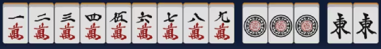
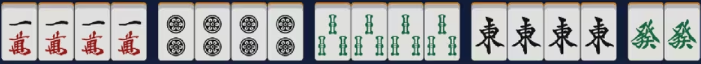
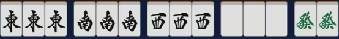
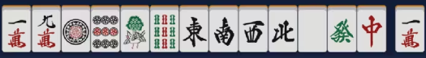

# 附录1：日麻役种表

> [链接：什么是役？](./2.0.md/#2.2)  
> 

 **一番** 

断幺九  
ダンヤオキュウ  

和牌时不包含幺九牌。  

枪杠
チャンカン  

荣和牌为别家补杠时所补杠牌。国士无双可抢暗杠。  

岭上开花
リンシャン  

开杠后用摸到的岭上牌和牌。  

海底摸月
ハイテイ  

最后一张牌自摸和牌。  

河底捞鱼
ホウテイ  

最后一张牌别家放铳和牌。

立直 门前清限定
リーチ  

门前清听牌时可花费1000点立直。

一发 门前清限定
イッパツ  

立直后一巡内无人鸣牌状态下和牌。鸣牌破坏一发。

门前清自摸和 门前清限定
ツモ  

门前清状态下自摸和牌。注意与立直不冲突。

平和 门前清限定
ピンフ  

和牌牌型为4个顺子+非役牌雀头，听牌为两面听。（役牌：场风/自风/白发中）

  

一杯口 门前清限定
イーペーコー  

有两组一样的顺子。

自风牌 
トン・ナン・シャ・ペイ  

自风牌组成刻子或杠子。

场风牌
トン・ナン・シャ・ペイ  

场风牌组成刻子或杠子。

三元牌
ハク・ハツ・チュン  

三元牌中任一个组成刻子或杠子。

宝牌 不单独成役
ドラ  

宝牌指示牌的下一张牌。

赤宝牌 不单独成役
アカドラ  

牌面为红色的5m、5p、5s牌。

里宝牌 不单独成役
リードラ  

立直和牌时可翻。宝牌指示牌下的牌的下一张牌。

燕返 古役
<ruby>燕返<rt>つばめがえ</rt></ruby>し  

荣和牌是别家立直宣言牌。仅限别家立直宣言时荣和。

杠振 古役
<ruby>槓振<rt>かんふ</rt></ruby>り  

荣和牌是别家岭上花牌。这里不局限于摸切岭上，别家开杠后切出牌荣和本役即成立。

十二落抬 古役
<ruby>十二落抬<rt>しーあるらおたい</rt></ruby>  

四副露后单骑听牌。副露包含暗杠。

---

 

 **二番** 

小三元
ショウサンゲン  

包含两种三元牌的刻子/杠子+剩下那种的雀头。

三杠子
サンカンツ  

一人开杠三次。

三暗刻
サンアンコウ  

拥有三组不是由碰形成的刻子。注意双碰听牌时荣和不算三暗刻。四暗刻双碰听牌时荣和算三暗刻。

混老头
ホンロウトウ  

和牌时只含老头牌和字牌。（必须有字牌才算混老头）

对对和
トイトイ  

和牌时为4组刻子+雀头。

三色同顺 副露减1番
サンショクドウシュン  

有万子、筒子、索子数字相同的顺子牌。

三色同刻
サンショクドーコー  

有万子、筒子、索子数字相同的刻子牌。

混全带幺九 副露减1番
チャンタ  

所有顺子牌均带老头牌，所有刻子牌均是幺九牌刻子，雀头是幺九雀头。（必须带顺子，否则为混老头）

一气通贯 副露减1番
イッツートウカン  

同花色组成123、456、789三组顺子。

两立直 门前清限定
ダブルリーチ  

第一巡无人鸣牌立直。

七对子 门前清限定
チートイツ  

七种**不同的**对子。注意一个暗杠+五组对子不构成七对子，一个暗刻+五组对子自然不构成七对子听牌。

一色三步高 古役
<ruby>三連刻<rt>サン​レンコー</rt></ruby>  

同种花色连续三个数的刻子。例如111222333。与一色三同顺冲突。门清时一般认为是一色三同顺。

五门齐 古役
<ruby>五門斉<rt>うーめんさい</rt></ruby>  

和牌时同时包含万、索、筒、风、元牌。

---

 

 **三番** 

混一色 副露减1番
ホンイツ  

只包含1种花色+字牌。

纯全带幺九 副露减1番
ジュンチャンダイヤオキュウ  

不包含字牌的混全带幺九。即有顺子、每个顺子都带老头牌、每个刻子都是老头牌、雀头是老头牌。  

二杯口 门前清限定
リャンペーコー  

含两组一杯口。与七对子冲突，满足二杯口时均不计七对子。  

一色三同顺 古役
<ruby>一色三同順<rt>いっしょくさんじゅん</rt></ruby>  

一杯口额外加一组同样的顺子。例如111222333。与一色三步高冲突。门清时一般认为是一色三同顺。

---

 

 **六番** 

清一色 副露减1番
チンイツ  

只包含一种数牌花色。

---

 

 **满贯** 

流局满贯 M规/T规不成立
フローグランドスラム  

荒牌流局时，牌河的牌没有被别家鸣过，且全是幺九牌。注意**允许**副露其他家牌。  

---

 

 **役满** 

大三元
ダイサンゲン  

带白、发、中的刻子/杠子。

!!! Tip
    可以与四杠子、字一色、四暗刻、四暗刻单骑、天和、地和叠加，最多五倍役满160,000/240,000点。

小四喜
ショウスーシー  

带风牌的三种刻子/杠子+剩下一种风牌的雀头。

!!! Tip
    可以与四杠子、字一色、四暗刻、四暗刻单骑、天和、地和叠加，最多五倍役满160,000/240,000点。

四杠子
スーカンツ  

一人开杠四次。

!!! Tip
    可以与大三元、小四喜、大四喜、清老头、字一色、四暗刻、四暗刻单骑叠加，最多六倍役满192,000/288,000点。

清老头
チンロウトウ  

牌中只包含老头牌。

!!! Tip
    可以与四杠子、四暗刻、四暗刻单骑、天和、地和叠加，最多四倍役满128,000/192,000点。

字一色
ツーイーソー  

牌中只包含字牌。

!!! Tip
    可以与大三元、小四喜、大四喜、四杠子、四暗刻、四暗刻单骑、天和、地和叠加，最多六倍役满192,000/288,000点。

绿一色
リューイーソー  

牌中只包含2s、3s、4s、6s、8s、6z。

!!! Tip
    可以与四杠子、四暗刻、四暗刻单骑、天和、地和叠加，最多四倍役满128,000/192,000点。

四暗刻
スーアンコウ  

牌由四组暗刻/暗杠+一个雀头组成，且双碰听牌自摸和。注意双碰听牌时荣和算三暗刻，放铳牌相当于使一个刻称为明刻。

!!! Tip
    可以与大三元、小四喜、大四喜、清老头、字一色、绿一色、天和、地和叠加，最多五倍役满160,000/240,000点。

国士无双
コクシムソウ  

牌组合为1m, 9m, 1p, 9p, 1s, 9s, 1z, 2z, 3z, 4z, 5z, 6z, 7z再加以上十三种牌中的任何一种，且听牌时只听一张牌。

!!! Tip
    可以与天和、地和叠加，最多两倍役满64000点。

九莲宝灯
チューレンポウトウ  

牌组合为某一花色的1,1,1,2,3,4,5,6,7,8,9,9,9再加该花色的任何一张牌，且听牌时只听一张牌。

!!! Tip
    可以与天和、地和叠加，最多两倍役满64000点。

天和
テンホウ  

庄家第一巡自摸和牌。

!!! Tip
    可以与大三元、小四喜、清老头、字一色、绿一色、四暗刻、四暗刻单骑、国士无双、九莲宝灯、大四喜、四暗刻单骑、国士无双是三面、纯正九莲宝灯叠加，最多六倍役满192,000/288,000点。不过由于纯靠运气且概率极低，因此这种役满经常不被重视。

地和
チーホウ  

闲家第一巡无人鸣牌的状态下自摸和牌。

!!! Tip
    可以与大三元、小四喜、清老头、字一色、绿一色、四暗刻、四暗刻单骑、国士无双、九莲宝灯、大四喜、四暗刻单骑、国士无双是三面、纯正九莲宝灯叠加，最多六倍役满192,000/288,000点。不过由于纯靠运气且概率极低，因此这种役满经常不被重视。

人和 古役
<ruby>人和<rt>レンホー</rt></ruby>  

闲家第一巡无人鸣牌且未摸牌的状态下荣和和牌。

石上三年 古役
<ruby>石の上にも三年<rt>いしうえさんねん</rt></ruby>  

双立直+海底/河底。

黑一色 古役
<ruby>黒一色<rt>へいいーそー</rt></ruby>  

和牌时只包含2p, 4p, 8p, 1~4z。

大数邻 古役
<ruby>大数隣<rt>だいすうりん</rt></ruby>  

断幺+万清一色+七对子和牌。

大车轮 古役
<ruby>大車輪<rt>だいしゃりん</rt></ruby>  

断幺+筒清一色+七对子和牌。

大竹林 古役
<ruby>大竹林<rt>だいちくりん</rt></ruby>  

断幺+索清一色+七对子和牌。

大七星 古役
<ruby>大七星<rt>ダイチーシン</rt></ruby>  

字一色+七对子和牌。

---

 

 **两倍役满** 

大四喜
ダイスーシー  

由东南西北四种风的四组刻子组成再加任意雀头。

!!! Tip
    可以与字一色、四暗刻、四暗刻单骑、天和、地和叠加，最多五倍役满160,000/240,000点。

四暗刻单骑
スーアンコウダンキ  

牌由四组暗刻/暗杠+一个雀头组成，且听牌单骑和。荣和时仍然成立。

!!! Tip
    可以与大三元、小四喜、大四喜、清老头、字一色、绿一色、天和、地和叠加，最多六倍役满192,000/288,000点。

国士无双十三面
コクシムソウジュウサンメン  

牌组合为1m, 9m, 1p, 9p, 1s, 9s, 1z, 2z, 3z, 4z, 5z, 6z, 7z再加以上十三种牌中的任何一种，且听牌时听十三面牌。

!!! Tip
    可以与天和、地和叠加，最多三倍役满96,000/144,000点。由于在听牌前不抓到相同牌的概率极低，因此绝大部分情况下，国士无双十三面都是在国士无双已可和牌的前提下选择振听听牌来追自摸国士无双十三面。如果本局牌山余20张以上且幺九牌余至少8张时推荐此做法。

纯正九莲宝灯
ジュンセイチューレンポウトウ  

牌组合为某一花色的1,1,1,2,3,4,5,6,7,8,9,9,9再加该花色的任何一张牌，且听牌时的牌型就已经是1,1,1,2,3,4,5,6,7,8,9,9,9，即听牌时可以听9张牌。

!!! Tip
    可以与天和、地和叠加，最多三倍役满96,000/144,000点。由于在听牌前不抓到相同牌的概率极低，因此绝大部分情况下，纯正九莲宝灯都是在九莲宝灯已可和牌的前提下选择振听听牌来追自摸纯正九莲宝灯。如果本局牌山余28张以上且同花色牌余至少8张时推荐此做法。

